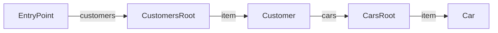
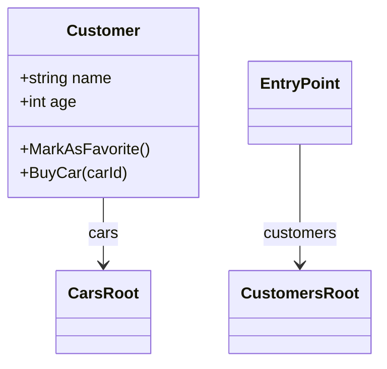

# Hypermedia Schema — Design Document

> **Plan execution in progress.** Last completed: **Step 6.7** (Controller convenience + DI wiring). Next: **Step 6.8** (JsonSchema package update).

## Table of Contents

- [Goal](#goal)
- [Architecture Overview](#architecture-overview)
- [Schema Model](#schema-model)
  - [Top-Level: HypermediaApiSchema](#top-level-hypermediaapischemahttpschema)
  - [Entity Type: EntityTypeSchema](#entity-type-entitytypeschema)
  - [Data Shapes and Shared Definitions](#data-shapes-and-shared-definitions)
  - [Hypermedia Graph: Links](#hypermedia-graph-links)
  - [Hypermedia Graph: Actions](#hypermedia-graph-actions)
  - [Hypermedia Graph: Embedded Entities](#hypermedia-graph-embedded-entities)
- [Source Generator](#source-generator)
  - [Project Setup](#project-restyard-htosourcegenerators-netstandard20)
  - [Input Analysis](#input-analysis)
  - [Generated Output per HTO](#generated-output-per-hto)
  - [Generated Schema Registry](#generated-schema-registry)
- [Runtime Schema Endpoint](#runtime-schema-endpoint)
- [Mermaid Diagram Mapper](#mermaid-diagram-mapper)
- [Replacing the Siren Formatter](#replacing-the-siren-formatter)
- [Siren POCO Model](#siren-poco-model)
- [Project Structure](#project-structure)
- [Intentionally Excluded from Schema](#intentionally-excluded-from-schema)
- [Design Decisions](#design-decisions)
- [CLI Tooling for Schema and Diagram Generation](#cli-tooling-for-schema-and-diagram-generation)
- [Open Questions](#open-questions)

## Goal

Replace the runtime reflection-based Siren serialization with source-generated mappers, and introduce a self-describing schema model for the hypermedia API. The schema model serves as a single source of truth for:

- **Runtime Siren serialization** — generated `ToSiren()` methods per HTO, replacing `SirenConverter` and `SirenHypermediaFormatter`
- **Runtime schema endpoint** — dedicated endpoint serving the full API schema as JSON
- **Documentation UI** — consumes the schema endpoint to render an interactive API explorer
- **Mermaid diagram export** — generates Mermaid class/graph diagrams for markdown-based documentation
- **Client code generation** — generates typed clients in C#, TypeScript, Python from the schema

## Architecture Overview

```
  HTO source code + Controller source code
  (C# classes, attributes, XML doc comments)
              |
              | [Source Generator — compile time]
              v
      +-------+-------+
      |               |
  ToSiren()      GetSchema()
  extension      extension
  method         method
  per HTO        per HTO
      |                |
      |                +---> Per-assembly Schema Registry (generated)
      |                         |
      |                         +---> Aggregated via DI at startup (no reflection)
      |                         |
      |                         +---> JSON endpoint (runtime)
      |                         +---> Mermaid mapper (runtime or build-time)
      |                         +---> Documentation UI (consumes endpoint)
      |                         +---> Client generators (consume JSON)
      |
      +---> Called directly in controllers
              -> returns SirenEntity POCO
              -> standard JSON serialization
```

## Schema Model

The schema spec describes two things that Siren itself does not provide:

1. **Data shapes** — JSON Schemas for entity properties and action parameters
2. **Hypermedia graph** — how entity types connect via links, actions, and embedded entities

The Siren spec already defines what an entity *looks like* at runtime (class, title, properties, links, actions, entities). This schema does not duplicate that. Instead it provides the **type-level metadata** that Siren responses lack: what properties a Customer *always* has, what actions are available, what parameters they expect, and how entity types relate to each other.

### Top-Level: `HypermediaApiSchema`

```csharp
public class HypermediaApiSchema
{
    public string SchemaVersion { get; set; }               // Schema format version (semver of this spec format)
    public string? ApiVersion { get; set; }                 // Version of the API described by this schema
    public string? Title { get; set; }                      // API title
    public string? Description { get; set; }                // API description
    public string? ExternalDocsUrl { get; set; }            // Link to external documentation (e.g., RESTyard-Docs site)
    public string EntryPointName { get; set; }                   // References EntityTypeSchema.Name of the entry point
    public IReadOnlyList<EntityTypeSchema> EntityTypes { get; set; }
    public IDictionary<string, JsonDocument> Definitions { get; set; } // Shared type definitions, referenced via $ref
}
```

**Error responses:** All actions are expected to return [RFC 9457 Problem Details](https://www.rfc-editor.org/rfc/rfc9457) on failure. This is a convention of RESTyard APIs and does not need per-action error schema definitions. Client generators should always handle `application/problem+json` responses. The `HypermediaProblem` type on the server side and `IProblemStringReader` on the client side already implement this convention.

### Entity Type: `EntityTypeSchema`

Describes one type of Siren entity — its data shape and its hypermedia connections.

```csharp
public class EntityTypeSchema
{
    public string Name { get; set; }                        // Unique name, defaults to full class name (e.g., "HypermediaCustomerHto"), overridable via [HypermediaSchemaName]
    public IReadOnlyList<string> Classes { get; set; }      // Siren classes that identify this entity type
    public string? Title { get; set; }                      // From attribute or XML doc <summary>
    public string? Description { get; set; }                // From XML doc <remarks> or attribute

    // Data shape — JSON Schema for the Siren "properties" bag
    public JsonDocument? PropertiesSchema { get; set; }

    // Hypermedia graph — how this entity type connects to others
    public IReadOnlyList<LinkDescription> Links { get; set; }
    public IReadOnlyList<ActionDescription> Actions { get; set; }
    public IReadOnlyList<EmbeddedEntityDescription> EmbeddedEntities { get; set; }

    public bool IsDeprecated { get; set; }                  // Entire entity type marked for removal
    public string? DeprecationMessage { get; set; }         // Why deprecated and what to use instead
}
```

### Data Shapes and Shared Definitions

Entity properties (`PropertiesSchema`) and action parameters (`ActionDescription.ParameterSchema`) are both described using standard JSON Schema. Complex types (classes, records) and enums are always extracted to the top-level `Definitions` dictionary and referenced via `$ref`. Primitives and simple collections are inlined.

**JSON Schema representation:** All JSON Schema fields use `System.Text.Json.JsonDocument` on the public model types, keeping the schema model free of third-party type dependencies. The Mermaid and Markdown mappers convert to `JsonSchema` (from `JsonSchema.Net`) internally for strongly-typed keyword access. `IJsonSchemaFactory.Generate()` returns `JsonDocument`, and the source generator emits code that passes these directly into the schema model.

Example `PropertiesSchema` referencing a shared `Address` definition:

```json
{
  "type": "object",
  "properties": {
    "name": { "type": "string", "title": "The customer's full name" },
    "age": { "type": "integer", "title": "Age in years" },
    "address": { "$ref": "#/definitions/Address" },
    "tags": { "type": "array", "items": { "type": "string" } }
  },
  "required": ["name", "age"]
}
```

Example `Definitions`:

```json
{
  "Address": {
    "type": "object",
    "title": "Postal address",
    "properties": {
      "street": { "type": "string" },
      "city": { "type": "string" },
      "zipCode": { "type": "string" }
    },
    "required": ["street", "city", "zipCode"]
  },
  "CustomerSortProperties": {
    "type": "string",
    "enum": ["name", "age", "createdAt"]
  }
}
```

The source generator populates JSON Schema `title` and `description` from HTO source code (priority: attribute values, then XML doc `<summary>` for title, then `<remarks>` for description). This applies at every level including nested object properties.

### Hypermedia Graph: Links

Describes which relations an entity type exposes and what entity type they point to.

```csharp
public class LinkDescription
{
    public IReadOnlyList<string> Relations { get; set; }    // From [Relations]
    public string TargetName { get; set; }                  // Name of the target entity type (references EntityTypeSchema.Name)
    public IReadOnlyList<string> TargetClasses { get; set; }// Siren classes of the target entity type
    public string? MediaType { get; set; }                   // Declared media type hint — see note below
    public string? Title { get; set; }
    public string? Description { get; set; }
    public bool IsMandatory { get; set; }                   // Non-nullable ILink<T>
    public bool IsDeprecated { get; set; }                  // Marked for removal in a future version
    public string? DeprecationMessage { get; set; }         // Why deprecated and what to use instead
}
```

**`MediaType`**: When `null` (the default), the linked resource serves `application/vnd.siren+json`. When set, it declares the expected media type (e.g., `text/html` for an external website, `application/pdf` for a file download). This is a **type-level hint** — the schema declares what the link *typically* serves. However, clients must always check the actual Siren link's `type` field at runtime, because the server can override the media type dynamically per instance via `WithAvailableMediaType()`. A `null` schema `MediaType` does not guarantee Siren — it means "default, but verify at runtime."

### Hypermedia Graph: Actions

Describes which actions an entity type offers and what parameters they accept.

```csharp
public class ActionDescription
{
    public string Name { get; set; }                        // From [HypermediaAction(Name)]
    public string? Title { get; set; }
    public string? Description { get; set; }
    public string? ContentType { get; set; }                // Inferred: multipart/form-data for file uploads, application/json otherwise
    public JsonDocument? ParameterSchema { get; set; }          // JSON Schema for the parameter type (null if parameterless)
    public string? ResultName { get; set; }                    // Name of the result entity type (null if no result)
    public IReadOnlyList<string>? ResultClasses { get; set; } // Siren classes of the result entity (null if no result)
    public bool IsMandatory { get; set; }                   // Non-nullable action property (always present, may still have CanExecute guard)
    public bool IsFileUpload { get; set; }                  // FileUploadHypermediaAction
    public bool IsDeprecated { get; set; }                  // Marked for removal in a future version
    public string? DeprecationMessage { get; set; }         // Why deprecated and what to use instead
}
```

**`ResultName` / `ResultClasses`**: When non-null, indicates the action creates/returns a resource (HTTP `Location` header). `ResultName` references the target `EntityTypeSchema.Name`, `ResultClasses` provides the Siren classes for wire-format matching. Essential for client generators (e.g., `CreateCustomer` → `Customer`) since Siren itself doesn't describe action results. `null` = fire-and-forget.

### Hypermedia Graph: Embedded Entities

Describes which entity types can appear as embedded sub-entities.

```csharp
public class EmbeddedEntityDescription
{
    public IReadOnlyList<string> Relations { get; set; }
    public string TargetName { get; set; }                  // Name of the target entity type (references EntityTypeSchema.Name)
    public IReadOnlyList<string> TargetClasses { get; set; }
    public string? Title { get; set; }
    public string? Description { get; set; }
    public bool IsCollection { get; set; }                  // List of embedded entities
    public bool IsMandatory { get; set; }                   // Non-nullable embedded entity
    public bool IsDeprecated { get; set; }                  // Marked for removal in a future version
    public string? DeprecationMessage { get; set; }         // Why deprecated and what to use instead
}
```

## Source Generator

### Project: `RESTyard.HtoSourceGenerators` (netstandard2.0)

Required by Roslyn: source generators must target netstandard2.0.

**No dependency on `RESTyard.Schema`:** The generator emits source code as strings — it never instantiates schema model types at generator runtime. Adding a project reference would pull `JsonSchema.Net`, `System.Text.Json`, and other transitive dependencies into the compiler host, risking assembly loading conflicts. Instead, all emitted type names, property names, and namespaces are centralized in `SchemaTypeNames` (a constants class within the generator project). When new schema types or properties are emitted, add the corresponding constant there first.

### Input Analysis

The generator finds all types implementing `IHypermediaObject` in the compilation and extracts:

| Source | Data |
|---|---|
| `[HypermediaObject(Title, Classes)]` | Entity classes, title |
| `[HypermediaSchemaName("Name")]` | Custom schema name (default: full class name) |
| `[HypermediaProperty(Name)]` | Property name override |
| `[FormatterIgnoreHypermediaProperty]` | Property exclusion |
| `[Relations(rels)]` on `ILink<T>` | Link relations, target type |
| `[HypermediaAction(Name, Title)]` | Action name, title |
| `HypermediaAction<TParam>` | Parameter type |
| `IHypermediaActionParameter` properties | Action fields |
| `[Mandatory]` | Required fields |
| `[Key("name")]` | Route key properties |
| `FileUploadHypermediaAction` | File upload flag |
| `CanExecute()` method | Optional action flag (null property = omitted) |
| `[Title("...")]` (`JsonSchema.Net.Generation`) | Title (primary) |
| `[Description("...")]` (`JsonSchema.Net.Generation`) | Description (primary) |
| XML doc `<summary>` | Title (fallback when no `[Title]` attribute) |
| XML doc `<remarks>` | Description (fallback when no `[Description]` attribute) |
| XML doc `<summary>` on HTO class | `EntityTypeSchema.Title` (fallback when no `[HypermediaObject(Title)]`) |
| XML doc `<remarks>` on HTO class | `EntityTypeSchema.Description` |
| XML doc `<summary>` on link property | `LinkDescription.Description` |
| XML doc `<summary>` on action property | `ActionDescription.Description` (fallback when no `[HypermediaAction(Title)]` for title) |
| XML doc `<summary>` on embedded entity property | `EmbeddedEntityDescription.Description` |
| Nullable annotations | Nullability of properties, links |
| `[HypermediaActionEndpoint<THto>("prop")]` on controllers | Action-to-HTO mapping |
| `[HypermediaActionEndpoint<THto>("prop", ResultType = typeof(TResult))]` on controllers | Action result entity type — populates `ActionDescription.ResultName`/`ResultClasses`. Indicates the endpoint produces a Location header pointing to an entity of the specified HTO type. Optional — when not set, `ResultName` is null. |
| `[Obsolete("message")]` | Deprecation on entity types, actions, links, embedded entities |

**Constraint:** Each HTO has exactly one `[HypermediaObjectEndpoint<THto>]` and each action has exactly one `[HypermediaActionEndpoint<THto>("prop")]` in the codebase. This one-to-one mapping simplifies controller scanning — the generator can find the single matching endpoint for any HTO or action without disambiguation. If the generator finds multiple endpoints for the same HTO/action in the source assembly, it emits **RY0033** (error) — with duplicates the extracted mapping would be last-wins, i.e. arbitrary. The zero-endpoint case is deliberately *not* diagnosed: controllers may live in a different assembly the generator cannot see, so any missing-endpoint diagnostic would be a false positive there; the runtime route resolver already fails with a clear exception for genuinely missing routes.

### Generated Output per HTO

For each HTO class `HypermediaCustomerHto`, the generator emits two extension methods (`ToSiren()` and `ToSirenEmbedded()`) plus a schema method:

```csharp
// <auto-generated/>
public static class HypermediaCustomerHtoSirenMapper
{
    /// <summary>Top-level Siren entity. Used in controller returns.</summary>
    public static SirenEntity<HypermediaCustomerHtoProperties> ToSiren(
        this HypermediaCustomerHto hto, IHypermediaRouteResolver resolver,
        SirenMapperOptions? options = null)
    {
        var selfRoute = resolver.ObjectToRoute(hto);
        var entity = new SirenEntity<HypermediaCustomerHtoProperties>
        {
            Class = ["Customer"],
            Title = "A Customer",
            Properties = new HypermediaCustomerHtoProperties
            {
                Name = hto.Name,
                Age = hto.Age,
            },
            Links = new List<SirenLink>(),
            Actions = new List<SirenAction>(),
            Entities = new List<SirenSubEntity>(),
        };

        // Self link — auto-generated when options.AutoSelfLink is true (default)
        if (options?.AutoSelfLink != false)
        {
            entity.Links.Add(new SirenLink { Rel = ["self"], Href = selfRoute.Url });
        }

        // Links — resolve URLs at runtime, include media type from resolver
        if (hto.BestFriend is { } bestFriendLink)
        {
            var route = resolver.ReferenceToRoute(bestFriendLink.Value);
            entity.Links.Add(new SirenLink
            {
                Rel = ["bestFriend"],
                Href = route.Url,
                Type = route.AvailableMediaTypes.FirstOrDefault(),
            });
        }

        // Parameterless action — action classes from ActionClasses constants
        if (hto.MarkAsFavorite?.CanExecute() == true)
        {
            var actionRoute = resolver.ActionToRoute(hto, hto.MarkAsFavorite);
            entity.Actions.Add(new SirenAction
            {
                Name = "MarkAsFavorite",
                Title = "Mark as Favorite",
                Class = [ActionClasses.ParameterLessActionClass],
                Href = actionRoute.Url,
                Method = actionRoute.HttpMethod,
            });
        }

        // Action with parameters — schema URL in field class, prefilled values
        if (hto.CustomerMove?.CanExecute() == true)
        {
            var actionRoute = resolver.ActionToRoute(hto, hto.CustomerMove);
            var schemaRoute = resolver.RouteUrl(RouteNames.ActionParameterTypes,
                new { parameterTypeName = "NewAddress" });
            entity.Actions.Add(new SirenAction
            {
                Name = "CustomerMove",
                Title = "Customer moved",
                Class = [ActionClasses.ParameterActionClass],
                Href = actionRoute.Url,
                Method = actionRoute.HttpMethod,
                Type = "application/json",
                Fields =
                [
                    new SirenField
                    {
                        Name = "NewAddress",
                        Type = "application/json",
                        Class = [schemaRoute.GetValueOrThrow()],
                        Value = hto.CustomerMove.GetPrefilledParameter(),
                    },
                ],
            });
        }

        // Embedded entities — calls ToSirenEmbedded() (no intermediate SirenEntity allocation)
        foreach (var carEntity in hto.Cars)
        {
            var embedded = carEntity.Reference.GetInstance()!.ToSirenEmbedded(resolver, options);
            embedded.Rel = ["item"];
            entity.Entities.Add(embedded);
        }

        return entity;
    }

    /// <summary>
    /// Embedded Siren representation. Called by parent HTO's ToSiren() for nested entities.
    /// Hidden from IntelliSense — users should use ToSiren() instead.
    /// </summary>
    [EditorBrowsable(EditorBrowsableState.Never)]
    public static SirenEmbeddedEntity<HypermediaCustomerHtoProperties> ToSirenEmbedded(
        this HypermediaCustomerHto hto, IHypermediaRouteResolver resolver,
        SirenMapperOptions? options = null)
    {
        // Same property/link/action/entity mapping as ToSiren() — generator shares the logic
        var selfRoute = resolver.ObjectToRoute(hto);
        return new SirenEmbeddedEntity<HypermediaCustomerHtoProperties>
        {
            Class = ["Customer"],
            Title = "A Customer",
            Properties = new HypermediaCustomerHtoProperties { Name = hto.Name, Age = hto.Age },
            Links = [ /* same link resolution as ToSiren() */ ],
            Actions = [ /* same action resolution as ToSiren() */ ],
            Entities = [ /* same embedded entity resolution as ToSiren() */ ],
        };
    }

    // GetSchema() — returns EntityTypeSchema with PropertiesSchema, Links, Actions, EmbeddedEntities
    // populated from compile-time analysis (see Schema Model section for structure)
    public static EntityTypeSchema GetSchema() { /* ... */ }
}

// Generated properties POCO per HTO — the Siren "properties" bag as a strongly-typed class.
// [HypermediaProperty(Name)] is applied structurally: the C# property name IS the Siren name.
// [FormatterIgnoreHypermediaProperty] properties are omitted entirely.
// All other attributes from the HTO property are forwarded as-is (serializer attributes,
// converters, validation, third-party — the generator copies them without interpreting them).
public class HypermediaCustomerHtoSirenProperties
{
    public string? Name { get; set; }
    public int? Age { get; set; }

    // Attribute forwarded from HTO property — generator doesn't know what it does
    [JsonConverter(typeof(MoneyJsonConverter))]
    public Money? Balance { get; set; }

    // [HypermediaProperty(Name = "fullName")] on HTO → C# property named "fullName"
    // If user also has [JsonPropertyName("x")] on the HTO, it gets forwarded and
    // the serializer applies it on top — the user explicitly wanted that override.
    public string? fullName { get; set; }

    // [FormatterIgnoreHypermediaProperty] → property not present here at all
    // [Key("id")] → not forwarded (RESTyard routing concern)
    // [Relations] → not forwarded (link metadata, not a property)
}
```

**Design notes for generated `ToSiren()` / `ToSirenEmbedded()`:**
- `ToSirenEmbedded()` avoids constructing a `SirenEntity<T>` just to copy fields into `SirenEmbeddedEntity<T>` — one allocation, no copying.
- `[EditorBrowsable(Never)]` hides `ToSirenEmbedded()` from IntelliSense; users see only `ToSiren()`.
- The generator emits both methods from the same HTO metadata — the mapping logic (properties, links, actions, embedded entities) is shared internally.
- **Resolver API mapping:** `ObjectToRoute()` for self/entity URLs, `ReferenceToRoute()` for links, `ActionToRoute()` for action URLs + HTTP method, `RouteUrl(RouteNames.ActionParameterTypes, ...)` for parameter schema URLs.
- **Action classes:** Built-in markers (`ParameterActionClass`, `ParameterLessActionClass`, `FileUploadActionClass`, etc.) + user-defined classes from `[HypermediaAction(Classes = [...])]` are both included.
- **External actions/links:** `HypermediaExternalAction` uses `ExternalUri` directly; `ExternalReference` links use the reference URI — no route resolver call needed.
- **Link media types:** `SirenLink.Type` populated from `ResolvedRoute.AvailableMediaTypes` at runtime.
- **`SirenMapperOptions`** lives in `RESTyard.AspNetCore/Hypermedia/Siren/SirenMapperOptions.cs`. Created in Step 6.1, DI wiring in Step 6.5.
- **Generator constants:** All Siren type names (`SirenEntity`, `SirenLink`, etc.) added to `SchemaTypeNames` since the generator cannot reference `RESTyard.AspNetCore` types directly.

### `[assembly: HypermediaAssembly]` — Unified Marker Attribute

Assemblies that participate in RESTyard are marked with a single assembly-level attribute that serves three purposes:

1. **Assembly discovery** — `HypermediaAssemblyDiscovery.GetAssemblies()` scans loaded assemblies for this attribute, replacing manual `ControllerAndHypermediaAssemblies` lists
2. **Source generation gate** — the source generator only emits code for assemblies with this attribute
3. **Feature configuration** — boolean properties control which source generation features are active

```csharp
[assembly: HypermediaAssembly]                                    // discovered + schema generation
[assembly: HypermediaAssembly(Siren = true)]                      // + ToSiren() mappers
[assembly: HypermediaAssembly(Schema = false)]                    // discovered only, no generation (safety hatch)
[assembly: HypermediaAssembly(Siren = true, Schema = false)]      // warning: Schema forced to true (Siren requires it)
```

```csharp
[AttributeUsage(AttributeTargets.Assembly)]
public class HypermediaAssemblyAttribute : Attribute
{
    public bool Schema { get; set; } = true;     // generate GetSchema(), Properties POCO, registry
    public bool Siren { get; set; } = false;     // generate ToSiren() mappers (Phase 5)
}
```

The attribute is defined in `RESTyard.AspNetCore.Hypermedia.Attributes`.

**Rules:**
- **No attribute** → assembly not discovered, no source generation
- **Attribute present, defaults** → assembly discovered + schema generation enabled
- **`Schema = false`** → assembly discovered (for route resolution) but no source generation — useful as a safety hatch if the generator has a bug
- **`Siren = true`** → `Schema` implicitly forced to `true` (ToSiren needs the Properties POCO); if user explicitly sets `Schema = false` with `Siren = true`, the generator emits a diagnostic warning and treats `Schema` as `true`

**`HypermediaAssemblyDiscovery.GetAssemblies()`** — static helper that scans `AppDomain.CurrentDomain.GetAssemblies()` for `[HypermediaAssembly]` and returns them as an array. Provides a convention-based alternative to the manual assembly list:

```csharp
builder.Services.AddHypermediaExtensions(o =>
{
    // Convention-based: auto-discover from [HypermediaAssembly] attributes
    o.ControllerAndHypermediaAssemblies = HypermediaAssemblyDiscovery.GetAssemblies();

    // Or manual (still supported):
    // o.ControllerAndHypermediaAssemblies = [typeof(EntryPointController).Assembly];
});
```

### Generated Schema Registry

One registry per assembly. APIs spanning multiple assemblies get one registry each; they are aggregated at startup via DI.

```csharp
// <auto-generated per assembly/>
public static class HypermediaSchemaRegistry_MyAssembly
{
    public static IReadOnlyList<EntityTypeSchema> Schemas => [
        HypermediaCustomerHtoSirenMapper.GetSchema(),
        HypermediaEntrypointHtoSirenMapper.GetSchema(),
        HypermediaCarsRootHtoSirenMapper.GetSchema(),
        // ... all discovered HTOs in this assembly
    ];
}
```

### Runtime Opt-In: `AddHypermediaSchema()`

Schema features are activated at runtime via a **separate** DI method, decoupled from the core `AddHypermediaExtensions()`:

```csharp
// Core RESTyard (existing — route resolution, formatters)
builder.Services.AddHypermediaExtensions(o =>
{
    // Convention-based (recommended): auto-discover from [HypermediaAssembly] attributes
    o.ControllerAndHypermediaAssemblies = HypermediaAssemblyDiscovery.GetAssemblies();
    // Or manual: o.ControllerAndHypermediaAssemblies = [typeof(EntryPointController).Assembly];
});

// Schema feature (independent — schema endpoint, CLI generation)
builder.Services.AddHypermediaSchema(o =>
{
    o.Title = "Customer Management API";
    o.Description = "RESTyard-powered hypermedia API for managing customers and orders";
    o.ApiVersion = "1.2.0";
    o.EntryPointName = "Entrypoint";
    o.ExternalDocsUrl = "https://docs.example.com/api";
});

// ToSiren feature (future, Phase 5 — independent)
// builder.Services.AddHypermediaSirenMapper();
```

`AddHypermediaSchema()` does **not** read from `HypermediaExtensionsOptions` — it discovers registries independently by scanning all loaded assemblies for `[HypermediaSchemaRegistryAttribute]`. This avoids coupling the schema feature to the core options type.

**Runtime warning:** If `AddHypermediaSchema()` finds zero registries in loaded assemblies, it logs a warning: *"No HypermediaSchemaRegistry found in loaded assemblies. Ensure `[assembly: HypermediaAssembly]` is present in assemblies containing HTOs and that `Schema` is not set to `false`."* This catches both "forgot the attribute" and "attribute present but `Schema = false`" cases.

```csharp
public class HypermediaSchemaOptions
{
    public string? Title { get; set; }                  // Default: entry assembly name
    public string? Description { get; set; }            // Default: null
    public string? ApiVersion { get; set; }             // Default: null (must be set explicitly)
    public string? EntryPointName { get; set; }         // Default: auto-detected from [HypermediaObject] with "EntryPoint" class
    public string? ExternalDocsUrl { get; set; }        // Default: null
    public bool AllowUnresolvedReferences { get; set; } // Default: false — see "Startup validation" below
}
```

**Defaults:** When individual fields are null, sensible defaults are applied:
- `Title` → entry assembly name (e.g., `"CarShack"`)
- `ApiVersion` → null (omitted from JSON). Must be set explicitly — auto-detection from the entry assembly version was removed because HTOs may live in a different assembly, making the entry assembly version misleading.
- `EntryPointName` → auto-detected from entity types (first entity with Siren class `"EntryPoint"`, or null if none found)
- `Description` and `ExternalDocsUrl` → null (omitted from JSON)

`HypermediaSchemaOptions` is registered as a singleton via DI by `AddHypermediaSchema()`. Both `GenerateSchemaIfRequested` and the schema endpoint (Phase 3) resolve it from DI. `GenerateSchemaIfRequested` also accepts an optional explicit `HypermediaSchemaOptions` parameter that overrides DI — useful for generating variants (e.g., different title for internal vs. external docs).

This produces a singleton `HypermediaApiSchema` available via DI, combining all auto-discovered per-assembly registries.

**Startup validation:** During schema composition (`ComposeSchema()`, after cross-assembly action-result mappings are applied), the aggregated schema validates that all `TargetName` references in `LinkDescription`, `ActionDescription.ResultName`, and `EmbeddedEntityDescription` resolve to an existing `EntityTypeSchema.Name` (external links are exempt). Dangling references (e.g., a link to `"Order"` when no `OrderHto` exists) indicate a missing or unregistered HTO and log one warning per unresolved name, listing every referencing site. The option `HypermediaSchemaOptions.AllowUnresolvedReferences = true` (default `false`) is for development scenarios — when enabled, unresolved references generate placeholder `EntityTypeSchema` entries (with empty links/actions/properties) so the schema endpoint and Mermaid diagrams remain functional while the API is still being built.

## Runtime Schema Endpoint

Served via a dedicated ASP.NET Core endpoint:

```csharp
app.MapHypermediaSchema();                          // default: /hypermedia-schema
app.MapHypermediaSchema("/custom/schema/route");     // or configure a custom route

// Internally resolves HypermediaApiSchema from DI and serializes it
```

Returns JSON. Content type: `application/vnd.restyard.hypermedia-schema+json`.

The schema intentionally does not contain resolved URLs or route templates. Clients discover URLs at runtime by navigating the hypermedia API starting from the entry point — this is a core principle of hypermedia. The schema describes the *shape* of the API (entities, relations, actions, properties) not the *location* of resources.

## API Guide Endpoint

> **Status:** design. New sibling to the schema endpoint, driven by the `guide` verb in
> `HypermediaAgentInterface-Design.md`. Same *serving mechanic* as the schema endpoint; different content
> *layer* — the guide is **authored** (human-written intent/glossary Markdown), not **generated** from
> types. Keep the two layers separate (see the "three knowledge layers" rule in the agent-interface design).

Same concept as serving an OpenAPI spec (or the schema endpoint above): a well-known, discoverable HTTP
endpoint that serves a description document. Both files follow the identical pattern:

| | Schema endpoint (done) | Guide endpoint (new) |
|---|---|---|
| Mapping call | `app.MapHypermediaSchema()` | `app.MapApiGuide()` |
| Default route | `/hypermedia-schema` | `/api-guide` |
| Route overridable | yes (`o => o.Route = ...`) | yes (`o => o.Route = ...`) |
| Content | generated `HypermediaApiSchema` JSON | authored Markdown |
| Media type | `application/vnd.restyard.hypermedia-schema+json` | `text/vnd.restyard.api-guide+markdown` |
| Link helper (advertise on any HTO) | `HypermediaSchema.Link()` | `ApiGuide.Link()` |
| Typical rel | `schema` | `api-guide` |

```csharp
app.MapApiGuide();                          // default: /api-guide
app.MapApiGuide(o => o.Route = "/api/guide"); // or configure a custom route
```

- **Opt-in, like the schema endpoint** — omit the call and the guide isn't exposed. No guide is registered
  by default (an API without an authored guide simply doesn't map it).
- **Advertise via a link on any HTO** — `ApiGuide.Link()` mirrors `HypermediaSchema.Link()`
  (an `ExternalLink`/`InternalReference` to the named guide route with the correct media type). Normally
  placed on the **entry point** under the `api-guide` rel so the CLI's `guide` verb can discover it by
  following the rel — never a hardcoded path.
- **Degrades gracefully** — when no guide endpoint/rel exists, the `guide` verb falls back to pure
  navigation (per the agent-interface design).

**Media type — settled:** `text/vnd.restyard.api-guide+markdown`. A **custom vendor subtype whose
body is raw Markdown**:
- `text/` is the correct top-level for Markdown (RFC 7763 registers `text/markdown`) — gives `charset`
  semantics and signals human-readable text the `guide` verb consumes raw.
- `vnd.restyard.…` marks it vendor-specific, consistent with `SchemaMediaTypes.HypermediaApiSchema`.
- `+markdown` names the concrete serialization. **Not** an IANA-registered structured syntax suffix
  (RFC 6839 lists `+json`/`+xml`/`+cbor`/…) — a deliberate RESTyard-internal convention, matched as a plain
  string. A `+json` envelope was rejected: wrapping Markdown in JSON forces the agent to unwrap a string
  before reading, defeating "Markdown is what LLMs read fluently."
- Constant home is **`DefaultMediaTypes.ApiGuide`** (`Source/Shared/DefaultMediaTypes.cs`,
  namespace `RESTyard.MediaTypes`) — **not** `SchemaMediaTypes`. The guide is not a schema concept; it sits
  with `Siren` / `JsonSchema` / `ProblemJson`.

**Content source — settled:** **file path + optional provider**, exposed as overloads:
- File-path overload for the common case (`MapApiGuide("api-guide.md")` / `o.FilePath`).
- Provider overload for dynamic/per-user/localized content — `IApiGuideProvider` (receives
  `HttpContext`, returns the Markdown), supplied directly or resolved from DI.
- Embedded resource / raw string are just convenience wrappers over the file-path/provider forms if wanted.

**Project placement — settled:** the guide is **not schema-related** — it's a runtime ASP.NET Core delivery
feature with no dependency on the source generator or schema model. Placement:
- Endpoint machinery (`MapApiGuide`, `ApiGuideEndpointOptions`, `IApiGuideProvider`,
  `ApiGuide.Link()`) → **`RESTyard.AspNetCore`**, beside `HypermediaSchemaEndpointExtensions.cs`.
- Media-type constant → **`Source/Shared/DefaultMediaTypes.cs`** (`DefaultMediaTypes.ApiGuide`).
- `api-guide` rel → **`Source/Shared/DefaultHypermediaRelations.cs`** (`DefaultHypermediaRelations.ApiGuide`).
- *Note:* this section documents the feature; the implementation is **done** (plan Phase 6C) but the code
  does not land in `RESTyard.Schema`. The endpoint is **optional/opt-in** and is built here as
  forward-looking groundwork for the agent interface — nothing else in this effort depends on it.
  User-facing documentation: `Docs/HypermediaSchema/ApiGuideEndpoint.md`.

**Cache headers (both endpoints — schema and guide, opt-in):** both documents change only on deploy, and
the agent-interface caching policy is strictly server-driven — clients cache only what the server declares.
Both endpoints support an **opt-in** `Cache-Control` header via **`CacheMaxAge`** (`TimeSpan?`, **default
`null` = no header**), enabled directly in the map call:
`app.MapHypermediaSchema(o => o.CacheMaxAge = TimeSpan.FromMinutes(5))`.
- **Opt-in, not default-on:** avoids a silent behavioral change to the already-shipped schema endpoints
  and removes any need to auto-detect cache visibility from the configured mode — the author enabling
  caching states visibility explicitly.
- **`CacheVisibility` (`Public`/`Private`), flat default `Private`** — safe in every mode; setting `Public`
  is an explicit author assertion that the response is caller-independent. Conservative default because
  the risk is asymmetric: unnecessary `private` costs cache efficiency, wrong `public` leaks data.
  One hard guard: the access-group-filtered schema endpoint cannot be made `public` — the framework knows
  that response varies per caller, and a shared cache serving it across callers would leak data.
  Implemented as compile-time absence: its options class has `CacheMaxAge` but no `CacheVisibility`,
  so the endpoint always emits `private`.
- **ETag/`304` deliberately deferred** — the documents are small, so revalidation's payoff doesn't justify
  content-hashing and validator handling now; can be added later as an opt-in enhancement.
- Tracked as plan Step 6C.5 (includes retrofitting the already-implemented schema endpoints) — **done**.

## Mermaid Diagram Mapper

Converts `HypermediaApiSchema` to Mermaid diagram strings. Two diagram types:

### Entity Relationship Diagram

Shows HTO types, their links, and embedded entity relationships:



### Detailed Class Diagram

Shows properties and actions per entity:



### MermaidMapperOptions

```csharp
public class MermaidMapperOptions
{
    /// When true (default), the class diagram includes entity properties.
    /// Set to false to reduce diagram size for APIs with many properties.
    public bool IncludeProperties { get; set; } = true;

    /// When true (default), the class diagram includes actions.
    /// Set to false to reduce diagram size for APIs with many actions.
    public bool IncludeActions { get; set; } = true;
}
```

### API

```csharp
public static class MermaidMapper
{
    public static string ToApiMap(this HypermediaApiSchema schema);       // graph LR
    public static string ToClassDiagram(this HypermediaApiSchema schema, MermaidMapperOptions? options = null); // classDiagram
}
```

Can be used at runtime (via endpoint) or at build time (MSBuild task or CLI tool writing `.md` files).

**JSON Schema parsing limitations:** The class diagram extracts property names and types from `PropertiesSchema` by reading only the top-level `type` field of each property in the JSON Schema `properties` object. Complex constructs (`$ref`, `allOf`/`anyOf`/`oneOf`, nested objects, array item types) are not resolved and display as `object`. This is intentional — the diagram is a visualization aid, not a schema validator.

## Markdown Documentation Mapper

Converts `HypermediaApiSchema` to a Markdown API reference document. Designed for human consumption — describes entity types, their properties, links, actions, and embedded entities. No URL layout.

### Document Structure

1. **Header** — API title, description, version, external docs link (from `HypermediaApiSchema` top-level fields)
2. **Table of Contents** — anchor links to each entity section (optional, default: included)
3. **API Map** — embedded Mermaid entity graph via `schema.ToApiMap()` (optional, default: included)
4. **Entity sections** — one `##` section per entity type, ordered by BFS from entry point (cycle-safe via visited set)

### Entity Section Layout

Each entity section contains:

- **Title** — entity name as `##` heading, with `[Deprecated]` badge if applicable
- **Description** — from `EntityTypeSchema.Title` and `Description`
- **Siren classes** — listed for reference
- **Properties table** — from `PropertiesSchema` JSON Schema:

  | Property | Type | Required | Description |
  |---|---|---|---|
  | name | string | yes | The customer's full name |
  | age | integer | yes | |
  | address | object | no | |

- **Links table**:

  | Relation | Target | Description |
  |---|---|---|
  | self | [Customer](#customer) | |
  | bestFriend *(optional)* | [Customer](#customer) | The customer's best friend |
  | orders | [OrdersRoot](#ordersroot) | Order history |

- **Actions table**:

  | Action | Description |
  |---|---|
  | MarkAsFavorite | Mark as favorite |
  | CreateOrder | Creates a new order. Returns: [Order](#order) |

  For actions with parameters, an indented parameter sub-table follows:

  | Parameter | Type | Required |
  |---|---|---|
  | carId | integer | yes |
  | color | string | no |

- **Embedded Entities table**:

  | Relation | Target | Collection | Description |
  |---|---|---|---|
  | item | [Car](#car) | yes | |

### Rendering Rules

- **Deprecation**: Bold `**[Deprecated]**` badge before the name, `DeprecationMessage` shown as a note underneath. Applies to entities, actions, links, and embedded entities.
- **Optional indicators**: Non-mandatory links, actions, and embedded entities get an `*(optional)*` suffix on their name/relation. Mandatory is the default — no annotation.
- **Self links**: Included in the links table (unlike the Mermaid mapper which skips them).
- **Action results**: When `ActionDescription.ResultName` is set, the action description includes "Returns: [TargetName](#anchor)".
- **Cross-links**: Target names in links and embedded entities are rendered as Markdown anchor links `[Name](#anchor)` pointing to the corresponding entity section.
- **JSON Schema parsing**: Same limitation as the Mermaid mapper — only top-level `type` is read, complex types show as `object`. `$ref` is not resolved. See Open Questions for planned improvement.

### MarkdownMapperOptions

```csharp
public class MarkdownMapperOptions
{
    /// When true (default), includes a Table of Contents at the top.
    public bool IncludeTableOfContents { get; set; } = true;

    /// When true (default), embeds a Mermaid entity graph diagram after the header.
    public bool IncludeDiagram { get; set; } = true;
}
```

### API

```csharp
public static class MarkdownMapper
{
    public static string ToDocumentation(this HypermediaApiSchema schema, MarkdownMapperOptions? options = null);
}
```

## Replacing the Siren Formatter

### Current Flow (reflection-based)

```
Controller returns IHypermediaObject
    -> SirenHypermediaFormatter (output formatter)
        -> SirenConverter (reflection: walks properties, attributes)
            -> IHypermediaRouteResolver (resolves URLs)
        -> JSON serialization
    -> HTTP response
```

### New Flow: Two Approaches

There are two ways to use the generated `ToSiren()` mappers, addressing different needs:

#### Approach 1: Direct return from controller (recommended for new APIs)

```
Controller calls this.ToSiren(hto)
    -> extension method resolves IHypermediaRouteResolver from DI
    -> calls hto.ToSiren(resolver) internally
    -> returns SirenEntity<TProperties> wrapped in OkObjectResult
    -> standard ASP.NET Core JSON serialization
    -> HTTP response
```

```csharp
[HttpGet("{id}")]
[HypermediaObjectEndpoint<HypermediaCustomerHto>(typeof(CustomerRouteKeyProducer))]
public IActionResult Get(int id)
{
    var customer = _customerService.Get(id);
    var hto = new HypermediaCustomerHto(customer);
    return this.ToSiren(hto);  // extension method on ControllerBase
}
```

**Advantages:** Explicit return type enables correct OpenAPI schema generation — Swagger sees `SirenEntity<TProperties>`, not the HTO class. Full control over JSON serialization. Standard ASP.NET Core pattern with no magic middleware. Note: for RESTyard-native consumers, the `HypermediaApiSchema` (from the schema endpoint) is actually richer than OpenAPI — it describes the full hypermedia graph, not just data shapes. But OpenAPI compatibility matters when the API is consumed by mixed tooling (non-RESTyard clients, API gateways, documentation generators).

#### Approach 2: Generated output formatter (migration path for existing APIs)

```
Controller returns IHypermediaObject (unchanged)
    -> GeneratedSirenFormatter (output formatter, replaces SirenHypermediaFormatter)
        -> calls hto.ToSiren(resolver) via generated mapper (no reflection)
        -> JSON serialization
    -> HTTP response
```

```csharp
// No controller changes — existing code works as-is
[HttpGet("{id}")]
[HypermediaObjectEndpoint<HypermediaCustomerHto>(typeof(CustomerRouteKeyProducer))]
public IActionResult Get(int id)
{
    var customer = _customerService.Get(id);
    var hto = new HypermediaCustomerHto(customer);
    return Ok(hto);  // formatter handles ToSiren() automatically
}
```

**Advantages:** Drop-in replacement for existing APIs — no controller changes needed. Transparent performance improvement (generated mappers instead of reflection). Supports incremental migration: assemblies with `[HypermediaAssembly(Siren = true)]` use the generated formatter; assemblies without fall back to the existing `SirenConverter`. **Trade-off:** Same OpenAPI limitation as the current formatter — Swagger sees the HTO type, not the Siren output shape.

**Recommended migration path:** Existing API → add `[HypermediaAssembly(Siren = true)]` + `AddHypermediaSirenMapper()` → formatter handles `ToSiren()` automatically → optionally migrate controllers to `this.ToSiren(hto)` one by one → remove formatter when fully migrated.

The `SirenEntity<TProperties>` is a plain POCO — serialized as regular JSON by ASP.NET Core. The `TProperties` is a generated properties class per HTO (see [Generated Output per HTO](#generated-output-per-hto)) that carries all forwarded attributes from the HTO's properties. This ensures user-defined serializer attributes (`[JsonConverter]`, `[JsonPropertyName]`, third-party attributes, etc.) work correctly without RESTyard needing to interpret them.

**JSON serialization note:** Siren structural properties (`class`, `rel`, `href`, `title`, etc.) use explicit `[JsonPropertyName]` attributes on the Siren POCOs — these are always lowercase regardless of serializer configuration. However, the *entity properties* (the `TProperties` POCO) use the C# property names as-is (PascalCase by default, or as set by `[HypermediaProperty(Name)]`). **When using `ToSiren()` directly, the user is responsible for configuring the JSON serializer's naming policy** (e.g., `PropertyNamingPolicy = JsonNamingPolicy.CamelCase` for camelCase output). The existing `SirenConverter` always uses PascalCase for entity property names — this is a behavioral difference that must be documented in the migration guide.

### SirenMapperOptions

```csharp
public class SirenMapperOptions
{
    /// When true (default), the generated ToSiren() automatically adds a "self" link
    /// by resolving the HTO's own route via the route resolver.
    /// Set to false if self links are managed manually via explicit ILink properties.
    public bool AutoSelfLink { get; set; } = true;
}
```

Can be configured via DI (resolved by controller) or passed explicitly per call.

### Migration Path

1. Ship `ToSiren()` alongside existing formatter (opt-in per controller)
2. Verify parity via integration tests (compare JSON output)
3. Migrate controllers one by one from returning HTOs to returning `hto.ToSiren(resolver)`
4. Deprecate `SirenHypermediaFormatter` and `SirenConverter`
5. Remove in next major version

## Siren POCO Model

Needed for `ToSiren()` return type. Plain C# classes matching the Siren JSON spec. These types live as regular C# classes in `RESTyard.AspNetCore` under `Hypermedia/Siren/Model/`. Since every HTO project already references `RESTyard.AspNetCore`, no extra NuGet dependency is needed. Keeping them as real classes (rather than source-generated) makes them easy to read, edit, and navigate in the IDE.

**Reference**: The generated POCOs must conform to the official [Siren JSON Schema](https://github.com/kevinswiber/siren/blob/master/siren.schema.json). Property names, types, required fields, and structure should be validated against this schema. Any intentional deviations (e.g., the generic `SirenEntity<TProperties>` extension for typed properties) should be documented.

`SirenEntity<TProperties>` and `SirenEmbeddedEntity<TProperties>` are single generic classes (no non-generic base). Use `<object>` when the property type is not known at compile time. `SirenSubEntity` is the abstract base for sub-entities, with shared `Rel`, `Class`, `Title` properties. `SirenSubEntityConverter` handles polymorphic serialization/deserialization via structural discrimination (`properties`/`entities` → embedded, `href` → linked). The generated properties POCO per HTO (see [Generated Output per HTO](#generated-output-per-hto)) serves as `TProperties`.

```csharp
// Single generic class — returned by ToSiren(), TProperties is the generated properties POCO
// Use SirenEntity<object> when the property type is not known at compile time
public class SirenEntity<TProperties>
{
    public IReadOnlyList<string>? Class { get; set; }
    public string? Title { get; set; }
    public TProperties? Properties { get; set; }
    public IList<SirenLink>? Links { get; set; }
    public IList<SirenAction>? Actions { get; set; }
    public IList<SirenSubEntity>? Entities { get; set; }    // embedded or linked
}

public class SirenLink
{
    public IReadOnlyList<string> Rel { get; set; }
    public string Href { get; set; }
    public string? Title { get; set; }
    public string? Type { get; set; }
}

public class SirenAction
{
    public string Name { get; set; }
    public IReadOnlyList<string>? Class { get; set; }       // Action classification (e.g., ParameterActionClass)
    public string? Title { get; set; }
    public string Method { get; set; }
    public string Href { get; set; }
    public string? Type { get; set; }                       // Content-Type
    public IReadOnlyList<SirenField>? Fields { get; set; }
}

public class SirenField
{
    public string Name { get; set; }
    public IReadOnlyList<string>? Class { get; set; }       // Field classification
    public string? Type { get; set; }                       // HTML input type
    public string? Title { get; set; }
    public object? Value { get; set; }                      // Prefilled value
}

public abstract class SirenSubEntity
{
    public IReadOnlyList<string> Rel { get; set; }
}

// Single generic class — use SirenEmbeddedEntity<object> when property type is unknown
// Polymorphic serialization in IList<SirenSubEntity> handled by SirenSubEntityConverter
public class SirenEmbeddedEntity<TProperties> : SirenSubEntity
{
    public IReadOnlyList<string>? Class { get; set; }
    public string? Title { get; set; }
    public TProperties? Properties { get; set; }
    public IList<SirenLink>? Links { get; set; }
    public IList<SirenAction>? Actions { get; set; }
    public IList<SirenSubEntity>? Entities { get; set; }
}

public class SirenLinkedEntity : SirenSubEntity
{
    public string Href { get; set; }                        // Link to entity
    public IReadOnlyList<string>? Class { get; set; }
    public string? Title { get; set; }
    public string? Type { get; set; }
}
```

## Project Structure

```
Source/
  RESTyard.Schema/          # Schema model classes, mappers (regular library)
    Model/
      HypermediaApiSchema.cs
      EntityTypeSchema.cs
      LinkDescription.cs
      ActionDescription.cs
      EmbeddedEntityDescription.cs
    Mermaid/
      MermaidMapper.cs
      MermaidMapperOptions.cs
    Markdown/
      MarkdownMapper.cs
      MarkdownMapperOptions.cs
  RESTyard.HtoSourceGenerators/        # Source generator (netstandard2.0)
    HtoSirenGenerator.cs               # Emits ToSiren() per HTO
    HtoSchemaGenerator.cs              # Emits GetSchema() per HTO
    HtoRegistryGenerator.cs            # Emits HypermediaSchemaRegistry per assembly
  RESTyard.AspNetCore/                 # Existing — references Schema, adds endpoint
    Hypermedia/Siren/Model/            # Siren POCO types (regular C# classes)
      SirenEntity.cs                   # Non-generic base + SirenEntity<TProperties>
      SirenLink.cs
      SirenAction.cs
      SirenField.cs
      SirenSubEntity.cs
      SirenEmbeddedEntity.cs
      SirenLinkedEntity.cs
    Schema/
      HypermediaSchemaEndpoint.cs      # MapHypermediaSchema() — default route: /hypermedia-schema
  RESTyard.Schema.Test/     # xunit — unit tests for schema model and Mermaid mapper
  RESTyard.HtoSourceGenerators.Test/   # xunit + Verify — snapshot tests for generated ToSiren(), GetSchema(), registry
```

**Why Siren POCOs are in `RESTyard.AspNetCore`:** Every HTO project already references `RESTyard.AspNetCore`, so no extra dependency is needed. Keeping them as regular C# classes (rather than source-generated) makes them easy to read, edit, and navigate in the IDE. The source generator assembly cannot expose types to consuming projects (it runs inside the Roslyn compiler host, not at runtime).

**Why Schema is a separate library:** The schema model (`HypermediaApiSchema`, `EntityTypeSchema`, etc.) needs to be consumed by external tools — client generators, Mermaid CLI, documentation UIs — that deserialize the `/hypermedia-schema` JSON endpoint. These tools should not need to reference the full ASP.NET Core server library. Keeping the schema model in a lightweight standalone package enables this.

```
RESTyard.Schema       (netstandard2.0 — schema model + Mermaid)
    ^                   ^
    |                   |
RESTyard.AspNetCore     External tools (client generators, docs UIs)
(schema endpoint)       (deserialize /hypermedia-schema JSON)
```

## Intentionally Excluded from Schema

The existing contract-first XML schema (`Hypermedia.xsd` / `Hypermedia.cs`) contains several concepts that are **not** included in this runtime schema spec. These were evaluated and excluded for the following reasons:

- **Policies / Permissions** — Authorization is a server-side concern. The schema describes the shape of the API, not access control. Clients discover what operations are available by inspecting the hypermedia responses at runtime — if an action is present, the client is permitted to attempt it. Embedding permission metadata in the schema would couple clients to a specific authorization model.

- **Explicit query model** — The generator models queries as a distinct concept (`query` attribute on links, `isQueryResult` on documents) because it needs to generate `Link.ByQuery<T>()` code. From the schema's perspective, a query is simply an action that returns a result entity — the client POSTs parameters and follows the `Location` header. The existing `ActionDescription.ResultClasses` already captures this relationship. A separate query concept would leak server-side implementation details.

- **Property `isKey`** — Key properties identify which route parameters map to an entity. This is a server-side routing concern. Clients should treat `self` links as opaque identifiers (a core HATEOAS principle) and must not attempt to decompose or construct URLs from entity properties.

- **Property `hidden`** — This is a code-generation hint for UI scaffolding, not a structural API description. If needed, it could be expressed as a JSON Schema extension (`x-hidden`) on individual properties, but it does not warrant a first-class schema concept.

- **`contentType` on links, `parameterTypeName` on links, `collectionName` on entities, `ExternalParameterType`** — These are code-generation plumbing used by the contract-first generator to emit the right C# types and constructors. They have no meaning in a runtime API description.

## Design Decisions

- **`JsonDocument` for schema representation, `JsonSchema.Net` internal to mappers**: `PropertiesSchema`, `ParameterSchema`, and `Definitions` values use `System.Text.Json.JsonDocument` on the public model types — not `JsonSchema` from `JsonSchema.Net`. This keeps the schema model library-agnostic: consumers that deserialize the `/hypermedia-schema` endpoint only need `System.Text.Json`, not `JsonSchema.Net`. The Mermaid and Markdown mappers convert `JsonDocument` to `JsonSchema` internally (via `JsonSchemaExtensions.ToJsonSchema()`) to use strongly-typed keyword access (`PropertiesKeyword`, `TypeKeyword`, etc.) for extracting property names, types, and descriptions. `JsonSchema.Net` remains a dependency of `RESTyard.Schema` (for the mappers and `IJsonSchemaFactory` implementation) but does not leak onto the public API surface. `IJsonSchemaFactory` returns `JsonDocument`, and `JsonSchemaFactory` uses `JsonSchema.Net.Generation` internally behind this abstraction.
- **Schema versioning**: The schema format has its own semver (`SchemaVersion`), independent of the RESTyard package version. This allows the spec format to evolve at its own pace — a RESTyard update that doesn't change the schema shape doesn't bump the schema version, and vice versa.
- **External links/actions**: `ExternalLink` and `HypermediaExternalAction` have fixed URLs not resolved via route resolver. This is not a schema concern — the schema describes entity types and their relationships, not runtime URLs. External links are just links from the client's perspective; the client does not distinguish between internal and external.
- **Schema endpoint media type**: `application/vnd.restyard.hypermedia-schema+json`. Defined as `SchemaMediaTypes.HypermediaApiSchema` in `RESTyard.Schema`.
- **Schema link helper**: `HypermediaSchema.Link()` creates an `ExternalLink` pointing to the schema endpoint with the correct media type. Uses `InternalReference` with the named route — the framework resolves the URL via the route resolver. `HypermediaSchema.Link(HypermediaSchemaFilterParameters)` creates filtered schema links by passing filter parameters through `InternalReference`. The endpoint binds the same `HypermediaSchemaFilterParameters` via `[AsParameters]`, so both sides share one type — extending the parameters type works automatically on both sides.
- **No built-in schema HTO or filter action endpoint**: RESTyard does not ship a convenience HTO with a schema filter action. Instead, `HypermediaSchema.Link(filter)` provides the building block — users who want a hypermedia-discoverable filter action can build their own schema HTO and use the link helper to construct filtered URLs in the action handler. This keeps the framework minimal while enabling the pattern.
- **Incremental generator**: Use `IIncrementalGenerator` (the modern Roslyn API, better IDE performance).
- **HTO inheritance**: Flatten to concrete types. Siren has no inheritance concept, and flattening is simpler for client generators. Each concrete HTO becomes one `EntityTypeSchema`.
- **Deprecation**: The source generator reads C#'s built-in `[Obsolete("message")]` attribute. The message maps to `DeprecationMessage`, presence maps to `IsDeprecated = true`. This covers entity types, actions, links, and embedded entities at the schema model level. For **property-level deprecation** (individual properties on entity types and action parameters), `JsonSchemaFactory` registers an `IAttributeHandler<ObsoleteAttribute>` that emits the JSON Schema `deprecated: true` keyword. This means `[Obsolete]` on action parameter members flows through `schemaFactory.Generate(typeof(T))` automatically, and after Step 2.7.1, `[Obsolete]` on HTO properties is forwarded to the generated POCO and picked up by the same handler. Users should be aware that `[Obsolete]` on properties produces `deprecated` in the JSON Schema — this should be documented alongside the existing `[DisplayName]` → `title` and `[Description]` → `description` attribute handling in user documentation.
- **Shared definitions**: All complex types (classes, records) and enums are always extracted to the top-level `Definitions` dictionary and referenced via `$ref`. Primitives and simple collections are inlined. This keeps the generator logic simple — no need to track reuse counts.
- **Entity naming**: Each `EntityTypeSchema` has a `Name` used as the primary identifier in cross-references (`TargetName`), Mermaid diagrams, and documentation. By default, the name is the **full C# class name** (e.g., `"HypermediaCustomerHto"`) — no convention-based stripping is applied since user naming conventions may vary. To use a shorter or custom name, apply `[HypermediaSchemaName("Customer")]` on the HTO class:
  ```csharp
  [HypermediaObject(Title = "Customer", Classes = ["Customer"])]
  [HypermediaSchemaName("Customer")]
  public class HypermediaCustomerHto : HypermediaObject { }
  ```
  This is a separate attribute (not on `[HypermediaObject]`) because it is a schema concern, not a Siren serialization concern. The generator resolves `TargetName` for links and embedded entities by reading `[HypermediaSchemaName]` from the target HTO type, falling back to the full class name. Siren `Classes` are retained for wire-format matching but are not used for referencing within the schema. The generator must verify that both `Name` and `Classes` are unique across all entity types and emit a diagnostic error on collision. `[HypermediaSchemaName]` also serves to resolve name collisions in multi-assembly APIs — e.g., if both `Billing.CustomerHto` and `Shipping.CustomerHto` exist, they would collide on the default name `"CustomerHto"`. Applying `[HypermediaSchemaName("BillingCustomer")]` and `[HypermediaSchemaName("ShippingCustomer")]` resolves the collision explicitly.
- **Description population via XML doc extraction**: The source generator populates `Description` fields on `EntityTypeSchema`, `LinkDescription`, `ActionDescription`, and `EmbeddedEntityDescription` by extracting XML doc comments from the C# source via `ISymbol.GetDocumentationCommentXml()`. For **entity types**, `<summary>` maps to `Title` (fallback when `[HypermediaObject(Title)]` is not set) and `<remarks>` maps to `Description`. For **links, actions, and embedded entities** (which are properties on the HTO class), `<summary>` maps to `Description` since these elements already get their `Title` from attributes. This requires no new attributes — developers use standard XML doc comments that also serve IntelliSense. The same extraction pattern already applies to JSON Schema `title`/`description` on properties (lines 248-251). Example:
  ```csharp
  /// <summary>A customer with profile and order history.</summary>
  /// <remarks>Represents an active customer account in the system.</remarks>
  [HypermediaObject(Title = "Customer", Classes = ["Customer"])]
  public class HypermediaCustomerHto : HypermediaObject
  {
      /// <summary>The customer's complete order history.</summary>
      [Relations(["orders"])]
      public ILink<HypermediaOrderListHto>? Orders { get; set; }

      /// <summary>Creates a new order for this customer.</summary>
      [HypermediaAction(Name = "CreateOrder", Title = "Create Order")]
      public CreateOrderAction? CreateOrder { get; set; }
  }
  ```
  This produces: `EntityTypeSchema.Description = "Represents an active customer account in the system."`, `LinkDescription.Description = "The customer's complete order history."`, `ActionDescription.Description = "Creates a new order for this customer."`. This is particularly valuable for the Generic MCP Server design (see `GenericMcp-Design.md`) where descriptions become MCP tool descriptions that help LLMs understand what each action/link does.
- **Unified `[assembly: HypermediaAssembly]` attribute**: A single assembly-level attribute serves three roles: assembly discovery (replacing manual assembly lists), source generation gate, and feature configuration. Without this attribute, referencing `RESTyard.AspNetCore` (which bundles the generator) has no effect — no generated code, no new types, no risk of name collisions with existing code. Schema generation (`Schema = true`, the default) emits Properties POCO, `GetSchema()`, and the registry. Format-specific mappers (`Siren = true`, default `false`) are opt-in. `Schema = false` disables generation while keeping the assembly discoverable — a safety hatch for generator bugs. `HypermediaAssemblyDiscovery.GetAssemblies()` scans loaded assemblies for this attribute, offering a convention-based alternative to `ControllerAndHypermediaAssemblies`.
- **Decoupled DI registration — `AddHypermediaSchema()` separate from `AddHypermediaExtensions()`**: Schema features are activated at runtime via `AddHypermediaSchema()`, a separate extension method from the core `AddHypermediaExtensions()`. This avoids coupling `HypermediaExtensionsOptions` to schema concerns. `AddHypermediaSchema()` discovers per-assembly registries independently by scanning all loaded assemblies for `[HypermediaSchemaRegistryAttribute]` — it does not read `ControllerAndHypermediaAssemblies`. This means schema configuration has its own options type (`HypermediaSchemaOptions`), its own DI registrations, and no dependency on core options being registered first. The same pattern applies to the future `AddHypermediaSirenMapper()` (Phase 5). Each feature is independently addable: core → `AddHypermediaExtensions()`, schema → `AddHypermediaSchema()`, Siren mappers → `AddHypermediaSirenMapper()`.
- **Action result type via `ResultType` on `HypermediaActionEndpoint`**: To populate `ActionDescription.ResultName`/`ResultClasses`, the existing `HypermediaActionEndpointAttribute` is extended with an optional `ResultType` property:
  ```csharp
  [HypermediaActionEndpoint<HypermediaCustomersRootHto>("CreateQuery",
      ResultType = typeof(HypermediaCustomerQueryResultHto))]
  public IActionResult CreateQuery([FromBody] CustomerQuery query) { ... }
  ```
  `ResultType` indicates that this action endpoint produces a `Location` header pointing to an entity of the specified HTO type. When set, the source generator populates `ActionDescription.ResultName` and `ResultClasses` from the target HTO's schema metadata. When null (default), no result type is recorded — the action either returns no entity or the result is not statically known.

  **Alternatives considered:**
  - *New base class `HypermediaActionWithResult<TParam, TResult>`*: Semantically correct (the action owns its result type), but introduces a breaking change and two parallel class hierarchies. Rejected — too invasive for existing codebases.
  - *New separate attribute `[HypermediaActionResult]`*: Works but adds a new attribute when the existing `HypermediaActionEndpoint` already identifies the action. Rejected — unnecessary proliferation of attributes.
  - *Detecting `SwaggerResponseHeader` for 201 status*: Weak — indicates a Location header exists but not what entity it points to. An `RY` warning should be emitted when a 201 response annotation is found without `ResultType` set, hinting that the user may want to add it.

  The controller attribute approach is consistent with RESTyard's existing pattern — all action-to-controller binding (`[HypermediaActionEndpoint]`, `[HypermediaObjectEndpoint]`) is on the controller side. The result type is declared where the Location header is actually produced.

  **Legacy attribute support:** `ResultType` is also available on the legacy `HttpMethodHypermediaAction` base class (used by `[HttpPostHypermediaAction]`, `[HttpPatchHypermediaAction]`, etc.). The source generator scans both the new `[HypermediaActionEndpoint<T>]` and the legacy `[Http*HypermediaAction]` for `ResultType`. This allows existing projects using the contract-first generator (which emits legacy attributes) to add `ResultType` manually. Legacy support will be removed when the controller template is migrated to `[HypermediaActionEndpoint<T>]` (Phase 8, Step 8.4).

  **Multi-assembly:** When HTOs and controllers are in different assemblies, the source generator processing the HTO assembly won't see `ResultType` (it lives on controller attributes in the other assembly). The generator in the controller assembly emits a separate `HypermediaActionResultRegistry` containing `ActionResultMapping(EntityName, ActionName, ResultName, ResultClasses)` entries. `HypermediaSchemaBuilder.ComposeSchema()` merges these into the existing `ActionDescription` entries at compose time. The schema model is not changed — `ResultName`/`ResultClasses` are populated during post-processing, not during generation. Controller-only assemblies must also have `[assembly: HypermediaAssembly]` for the generator to run.

  **RY0032 diagnostic warning:** When `ResultType` is set to a type that does NOT have `[HypermediaObject]`, the generator emits a warning — the schema cannot describe a non-HTO result entity. This catches mistakes (wrong type) while allowing intentional non-HTO results (the user suppresses the warning). When triggered, `ResultName`/`ResultClasses` are NOT populated — the action is treated as having no result.

  **RY0031 diagnostic warning (planned):** When a controller method has `[HypermediaActionEndpoint]` without `ResultType` but has a 201-related attribute (`[ProducesResponseType(201)]`, `[SwaggerResponse(201)]`, `[SwaggerResponseHeader(201, ...)]`), the generator emits a warning suggesting the user may want to declare `ResultType`. Detection is by attribute name string matching and constructor argument value — no dependency on Swagger or ASP.NET Core packages. Standard suppression mechanisms apply (`#pragma`, `.editorconfig`, `<NoWarn>`).
- **`ResultType` as property, not generic type parameter (rejected alternative):** Considered refactoring `ResultType = typeof(TResult)` into a second generic: `HypermediaActionEndpoint<THto, TResult>`. This would require two separate attribute classes (C# doesn't support optional generic parameters) and could add a `where TResult : IHypermediaObject` constraint for compile-time safety. **Rejected because:** `ResultType` can legitimately be a non-HTO type (e.g., a plain DTO or external type). Without a meaningful constraint, the generic provides no safety advantage over `typeof()` — it's just shorter syntax. RY0032 already warns when `ResultType` is not an HTO, which covers the common mistake case. The named property `ResultType = typeof(...)` is also more readable than two long type names in angle brackets, and self-documents intent.
- **No HTTP method in schema**: `ActionDescription` intentionally omits the HTTP method. Clients discover it at runtime from the Siren action's `method` field. Client generators emit generic "execute action" calls — the runtime Siren response dictates the transport details. This keeps the schema focused on type-level metadata, not transport concerns.
- **Definition name collisions**: `Definitions` dictionary keys use simple class names (e.g., `"Address"`). When two types share the same simple name but differ by namespace (e.g., `Billing.Address` and `Shipping.Address`), the generator disambiguates by prefixing with the namespace segment: `"Billing_Address"`, `"Shipping_Address"`. Only the colliding names are qualified — non-colliding names stay short. The generator detects collisions across all types discovered in the compilation.
- **Siren properties as generated POCO, not dictionary**: The Siren `properties` bag is represented as a generated strongly-typed class per HTO (`SirenEntity<TProperties>`) rather than `Dictionary<string, object?>`. This preserves user-defined attributes on HTO properties — serializer converters, naming, third-party attributes — because the generator forwards them to the generated POCO. A dictionary would lose per-property attributes since the serializer would only see `object?` values. The non-generic `SirenEntity` base is used for embedded entity collections where property types are heterogeneous; STJ in .NET 8 serializes `SirenEntity<T>` using the runtime type when referenced through the base.
- **RESTyard attributes applied structurally by generator**: `[HypermediaProperty(Name)]` and `[FormatterIgnoreHypermediaProperty]` are consumed by the source generator and applied structurally to the generated properties POCO — `[HypermediaProperty(Name = "x")]` sets the C# property name to `x`, `[FormatterIgnoreHypermediaProperty]` omits the property entirely. These attributes are **not** forwarded to the generated code (they've already been applied). All other attributes on HTO properties are forwarded verbatim. This keeps RESTyard attributes as serializer-agnostic declarations of intent, while letting serializer-specific attributes compose on top. If a user has both `[HypermediaProperty(Name = "sirenName")]` and `[JsonPropertyName("jsonName")]`, the generated POCO property is named `sirenName` with `[JsonPropertyName("jsonName")]` forwarded — the serializer overrides the name, and that's the user's explicit choice.
- **Related entity validation — `[Relations]` is required on links and embedded entities**: An `ILink<THto>` or `IEmbeddedEntity<THto>` (or collection thereof) property without `[Relations]` is an error — Siren links and embedded entities require at least one relation. The source generator emits diagnostics `RY0021` (links) and `RY0020` (embedded entities) as warnings at compile time and excludes these properties from both the schema and the properties POCO. The existing `SirenConverter` should also detect this at runtime and throw an error. Similarly, the future generated `ToSiren()` methods should emit a compile-time error or refuse to serialize links/embedded entities without relations. This ensures the mistake is caught regardless of which serialization path is used.
- **JSON Schema generation — runtime delegation via `IJsonSchemaFactory`**: The source generator does **not** contain its own JSON Schema type mapping. Instead, the generated code calls `IJsonSchemaFactory.Generate(typeof(T))` at runtime for each property type that needs a schema. This reuses the existing `JsonSchemaFactory` in `RESTyard.AspNetCore` — including its custom generators for temporal types (`DateOnly`, `TimeOnly`, `DateTimeOffset`, `TimeSpan`), attribute handlers (`[DisplayName]` → `title`, `[Description]` → `description`), and any user-configured extensions. These attribute-to-JSON-Schema mappings apply to both action parameter properties and entity properties (via the generated POCO) and should be documented for users — they are the primary mechanism for adding `title`/`description` to property-level JSON Schema. The generated `GetSchema()` method receives the factory (via parameter or DI) and builds the `PropertiesSchema` at runtime. The same approach applies to action parameter schemas. This avoids duplicating type mapping logic and guarantees parity between the schema endpoint and the existing action parameter type endpoint.
  - **Caching**: `JsonSchemaFactory` already implements a `ConcurrentDictionary<Type, JsonDocument>` cache — repeated calls for the same type return the cached result. No additional caching needed.
  - **Entity properties via generated POCO instead of `SchemaHelper`**: Rather than generating individual `schemaFactory.Generate(typeof(string))` calls per property and gluing them together via `SchemaHelper.BuildPropertiesSchema`, the source generator emits a **properties POCO class** per HTO (e.g., `HypermediaCustomerHtoProperties`) and generates a single `schemaFactory.Generate(typeof(HypermediaCustomerHtoProperties))` call. The POCO contains only data properties (same filtering rules as the Siren properties POCO in Phase 5), with `[HypermediaProperty(Name)]` applied structurally and all non-RESTyard attributes forwarded verbatim. This means `[Title]`, `[Description]`, `[JsonConverter]`, and any 3rd-party attributes with registered `IAttributeHandler`s flow through `JsonSchema.Net`'s generation pipeline automatically — no custom JSON merging logic needed. XML doc comments from HTO properties are **copied verbatim** to the generated POCO (not converted to `[Title]`/`[Description]` attributes, to avoid pulling a `JsonSchema.Net.Generation` dependency into the source generator); a future `ISchemaRefiner` that reads XML doc comments would then pick them up for both entity properties and action parameters uniformly. This POCO is the **same type** reused in Phase 5 (Step 5.1) for `ToSiren()` Siren property mapping — one generated class serves both schema generation and Siren serialization. `SchemaHelper.BuildPropertiesSchema` becomes unnecessary for entity property schema generation and can be removed.
  - **AOT compatibility**: The runtime delegation approach uses reflection internally (via `JsonSchema.Net.Generation`), which is incompatible with NativeAOT trimming. This is acceptable for now — RESTyard and ASP.NET Core are reflection-heavy throughout. When AOT becomes a target, the planned migration path is a **two-phase build**: a post-compilation MSBuild task that loads the compiled assembly, runs `IJsonSchemaFactory` with the full DI configuration (preserving user-registered custom generators), and writes the resulting JSON Schema strings into a generated `.cs` file or embedded resource. This preserves `IJsonSchemaFactory` extensibility while eliminating runtime reflection. To be designed when AOT is actively pursued. 
    - Migrating to JsonSchema.net v8+ migth give better AOT support, but alos has breaking changes in the API -> check this

### Known Limitation: Minimal API and `ResultType`

Minimal API endpoints can serve as HTO and action endpoints by attaching metadata via `.WithMetadata()`. The `HypermediaApiExplorer` (which uses ASP.NET Core's `IApiDescriptionGroupCollectionProvider`) discovers both controller and minimal API endpoints.

However, `ResultType` on `[HypermediaActionEndpoint]` is read by the **source generator at compile time** — it scans controller method attributes in the compilation. `.WithMetadata()` calls are runtime code, invisible to the source generator. This means:

| Feature | Controller | Minimal API |
|---|---|---|
| `[HypermediaObjectEndpoint<T>]` route discovery | Yes (attribute) | Yes (`.WithMetadata()`) |
| `[HypermediaActionEndpoint<T>]` route discovery | Yes (attribute) | Yes (`.WithMetadata()`) |
| `[HypermediaAccessGroup]` on HTOs | Yes | Yes (attribute is on HTOs, not endpoints) |
| `ResultType` for schema generation | Yes (compile-time) | **No** (runtime-only, invisible to generator) |

**TODO:** To support `ResultType` with minimal API, consider a runtime registry for action result mappings (similar to `ActionResultRegistry` for multi-assembly support) or a separate attribute on the HTO action property itself (e.g., `[HypermediaAction(ResultType = typeof(X))]`).

## Future Idea: Access Groups

> **Status:** Future idea — not part of the initial implementation. To be revisited after the core schema and source generator are stable.

### Motivation

An AI agent or GUI consuming the hypermedia schema benefits from knowing upfront which actions and links require which permissions. Today, a client only discovers this at runtime — if an action is absent from a Siren response, it could mean "you lack permission" or "the entity's current state doesn't allow it." The schema can separate these two dimensions: **state-dependent availability** is already handled by `CanExecute` / nullable action properties, while **permission-dependent availability** is currently invisible.

This is purely descriptive metadata — the server still enforces authorization at runtime and omits actions/links from Siren responses based on actual permissions. Access groups tell the client what *could* be there given sufficient permissions.

### Approach: Access Groups on Elements

A `AccessGroups` string list on `EntityTypeSchema`, `LinkDescription`, `ActionDescription`, and `EmbeddedEntityDescription`. Declared via a `[HypermediaAccessGroup("admin", "sales", ...)]` attribute that accepts a `params string[]` of access group names. The source generator reads the attribute and emits the strings into the schema. `null` = no restriction (public). All discovered access groups are collected into `HypermediaApiSchema.DeclaredAccessGroups` automatically.

**Scope:** Entity types (HTO classes), actions, links, and embedded entities. **Not** individual properties — too granular, runtime visibility handles this.

### Schema Model Additions

```csharp
public class HypermediaApiSchema
{
    // ... existing fields ...
    public IReadOnlyList<string>? DeclaredAccessGroups { get; set; }  // All access groups found in the API, collected automatically
}

public class EntityTypeSchema
{
    // ... existing fields ...
    public IReadOnlyList<string>? AccessGroups { get; set; }  // null = no restriction (public)
}

public class ActionDescription
{
    // ... existing fields ...
    public IReadOnlyList<string>? AccessGroups { get; set; }
}

public class LinkDescription
{
    // ... existing fields ...
    public IReadOnlyList<string>? AccessGroups { get; set; }
}

public class EmbeddedEntityDescription
{
    // ... existing fields ...
    public IReadOnlyList<string>? AccessGroups { get; set; }
}
```

### Developer Usage

Access groups are declared close to the code via attributes:

```csharp
// Entity-level: entire HTO requires admin access
[HypermediaObject(Title = "Admin Dashboard", Classes = ["AdminDashboard"])]
[HypermediaAccessGroup("admin")]
public class HypermediaAdminDashboardHto : HypermediaObject { ... }

// Action with multiple access groups
[HypermediaAction(Name = "DeleteCustomer")]
[HypermediaAccessGroup("admin", "sales")]
public HypermediaAction? DeleteCustomer { get; set; }

// Action with single access group
[HypermediaAction(Name = "MarkAsFavorite")]
[HypermediaAccessGroup("write")]
public HypermediaAction? MarkAsFavorite { get; set; }

// Link with access group
[Relations(["orders"])]
[HypermediaAccessGroup("read")]
public ILink<HypermediaOrdersHto>? Orders { get; set; }

// No attribute = public (no restriction)
[Relations(["self"])]
public ILink<HypermediaCustomerHto> Self { get; set; }
```

No startup configuration needed — the source generator collects everything from attributes.

### Example Schema JSON

```json
{
  "declaredAccessGroups": ["read", "write", "admin"],
  "entityTypes": [
    {
      "name": "Customer",
      "actions": [
        { "name": "MarkAsFavorite", "requiredAccessGroups": ["write"] },
        { "name": "DeleteCustomer", "requiredAccessGroups": ["admin"] }
      ],
      "links": [
        { "relations": ["orders"], "requiredAccessGroups": ["read"] }
      ]
    }
  ]
}
```

### Filtered Schema Endpoint

The `/hypermedia-schema` endpoint supports access group filtering via query parameters. Two filtering modes are available — **include** and **exclude** — to cover the most common use cases:

```
GET /hypermedia-schema                                          → full schema (all access groups)
GET /hypermedia-schema?accessGroups=read                        → include: only elements requiring "read" or no access groups
GET /hypermedia-schema?accessGroups=read,write                  → include: elements requiring "read", "write", or no access groups
GET /hypermedia-schema?excludeAccessGroups=admin                → exclude: all elements except those requiring "admin"
GET /hypermedia-schema?excludeAccessGroups=admin,internal       → exclude: all elements except those requiring "admin" or "internal"
```

**Include mode** (`accessGroups`): Returns only elements whose `AccessGroups` are satisfied by the given set, plus elements with no access group restriction. Use case: "show me what the `read` role can see."

**Exclude mode** (`excludeAccessGroups`): Returns all elements *except* those whose `AccessGroups` intersect with the excluded set. Use case: "show me everything except `admin`-only elements."

Specifying both `accessGroups` and `excludeAccessGroups` is invalid — the endpoint returns `400 Bad Request in problem json format`.

### Server-Side Access Group Sanitization

The raw query parameters above are client-provided — the server must not blindly trust them. A server-side hook sanitizes the requested access groups based on the current user's permissions before filtering:

```csharp
/// <summary>
/// Hook that sanitizes access group filter requests based on the current user's context.
/// Registered via DI. Called by the schema endpoint before applying the filter.
/// </summary>
public interface ISchemaAccessGroupSanitizer
{
    /// <summary>
    /// Given the access groups the client requested, returns the access groups
    /// the client is actually allowed to see. The server can remove groups
    /// the user is not permitted to query, or add implicit groups.
    /// </summary>
    IReadOnlySet<string> SanitizeRequestedGroups(
        IReadOnlySet<string> requestedGroups,
        HttpContext httpContext);
}
```

**Default behavior** (when no `ISchemaAccessGroupSanitizer` is registered): pass through the requested groups unchanged — the schema endpoint is open. This matches the common case where the schema is public documentation.

**Example: admin-only groups hidden from non-admins:**

```csharp
public class RoleBasedSanitizer : ISchemaAccessGroupSanitizer
{
    public IReadOnlySet<string> SanitizeRequestedGroups(
        IReadOnlySet<string> requestedGroups, HttpContext httpContext)
    {
        var userRoles = httpContext.User.Claims
            .Where(c => c.Type == ClaimTypes.Role)
            .Select(c => c.Value)
            .ToHashSet();

        // Non-admins cannot request the "admin" access group — silently remove it
        if (!userRoles.Contains("admin"))
            return requestedGroups.Except(new[] { "admin" }).ToHashSet();

        return requestedGroups;
    }
}
```

The sanitizer is called **before** `HypermediaSchemaFilter` — the filter only sees the sanitized groups. This means a non-admin requesting `?accessGroups=read,admin` gets the same result as `?accessGroups=read`.

### Access Groups Discovery Endpoint

A dedicated endpoint exposes the access groups available to the current user:

```csharp
app.MapHypermediaSchemaAccessGroups();
// or with custom route:
app.MapHypermediaSchemaAccessGroups(o => o.Route = "/api/schema/access-groups");
```

**Default route:** `GET /schema/access-groups`

**Content type:** `application/vnd.restyard.hypermedia-schema-access-groups+json`

**Response:**

```json
{
  "accessGroups": ["read", "write"]
}
```

The endpoint reads `DeclaredAccessGroups` from the full schema and passes them through `ISchemaAccessGroupSanitizer` to filter to what the current user is allowed to see. A non-admin would see `["read", "write"]` while an admin sees `["read", "write", "admin"]`.

**Use cases:**
- **AI agents** — discover which access groups they can filter by before calling `/hypermedia-schema?accessGroups=...`
- **UIs** — populate a dropdown/checklist for schema filtering
- **Clients** — validate their own access level against the API's declared groups

Like `MapHypermediaSchema()`, it returns an `IEndpointConventionBuilder` so standard policies can be chained:

```csharp
app.MapHypermediaSchemaAccessGroups().RequireAuthorization();
```

When no `ISchemaAccessGroupSanitizer` is registered, the endpoint returns all `DeclaredAccessGroups` unfiltered.

### Future Idea: Schema as a RESTyard HTO

> **Status:** Idea — not designed. To be explored after the basic `/hypermedia-schema` endpoint and access group filtering are stable.

Instead of a plain JSON endpoint, the schema could be served as a proper RESTyard hypermedia resource — an HTO with a query action for filtering:

- **`HypermediaSchemaHto`** — the schema entity, with `DeclaredAccessGroups` exposed as a property
- **Query action** — accepts `accessGroups` / `excludeAccessGroups` as parameters, returns a filtered schema
- **`AvailableAccessGroups` property** — lists only the access groups the current user is allowed to query (post-sanitization), so the client knows upfront what it can filter by
- The query action's parameter is a string list — the client selects from `AvailableAccessGroups` (no dynamic enum generation needed)
- Both the query action parameters and the `AvailableAccessGroups` property are sanitized by `ISchemaAccessGroupSanitizer` — the user only sees and can query groups they are permitted to access
- The schema itself is still served as a JSON download link (not rendered as Siren) — the HTO wraps the query/filtering, not the schema content. This makes access group queries easy to discover and execute via the standard hypermedia pattern
- Consider making this a default endpoint (auto-registered like the existing action parameter schema endpoints) so users get it without manual controller setup

This approach stays within RESTyard's hypermedia design: the client discovers filtering capabilities by inspecting the schema HTO's actions rather than knowing the query parameter API. The `ISchemaAccessGroupSanitizer` hook feeds into `AvailableAccessGroups` — if a user can't see `admin`, it doesn't appear in the list and the query action doesn't accept it.

**Trade-off:** More complex to implement (needs a controller, route registration, Siren serialization of the schema HTO) vs. the simple `/hypermedia-schema` JSON endpoint. The plain endpoint is sufficient for programmatic consumers (client generators, AI agents) while the HTO approach benefits interactive UIs (HUI, API explorers).

Filtering logic:

**Access group semantics: OR (any match grants access).** An element annotated with `[HypermediaAccessGroup("admin", "sales")]` is visible to a user who has *either* "admin" or "sales" — they don't need both. This matches common role-based authorization patterns where any matching role grants access.

**Include mode** (given a set of granted access groups):
1. Remove entity types where none of the element's access groups are in the granted set
2. Remove actions where none of the element's access groups are in the granted set
3. Remove links where none of the element's access groups are in the granted set
4. Same for embedded entities
5. Remove unreachable entity types (see below)
6. Strip `DeclaredAccessGroups` from the filtered output (irrelevant)

**Exclude mode** (given a set of excluded access groups):
1. Remove entity types where any of the element's access groups intersect with the excluded set
2. Remove actions where any of the element's access groups intersect with the excluded set
3. Remove links where any of the element's access groups intersect with the excluded set
4. Same for embedded entities
5. Remove unreachable entity types (see below)
6. Strip `DeclaredAccessGroups` from the filtered output

**Unreachable entity type removal (`RemoveUnreachableEntityTypes`):**

After filtering elements, some entity types may no longer be referenced by any remaining link, embedded entity, or action result. These "orphaned" entity types are removed to keep the filtered schema clean.

An entity type is considered **reachable** if any of the following is true:
- It is the entry point (`EntryPointName`)
- It is the `TargetName` of any remaining link on any entity
- It is the `TargetName` of any remaining embedded entity on any entity
- It is the `ResultName` of any remaining action on any entity

Entity types that satisfy none of these conditions are removed. This is a single-pass check — it does not transitively chase references (i.e., if A links to B and B is the only reference to C, removing A's link to B removes B, but C is evaluated independently based on whether any other entity still references it).

```csharp
public static class HypermediaSchemaFilter
{
    /// Include mode: keep elements where AccessGroups ∩ grantedAccessGroups ≠ ∅ (or null). OR semantics.
    public static HypermediaApiSchema ForAccessGroups(
        HypermediaApiSchema fullSchema, ISet<string> grantedAccessGroups);

    /// Exclude mode: remove elements where AccessGroups ∩ excludedAccessGroups ≠ ∅.
    public static HypermediaApiSchema ExcludeAccessGroups(
        HypermediaApiSchema fullSchema, ISet<string> excludedAccessGroups);
}
```

Clients typically know their access groups from their auth context (JWT claims, API key metadata, etc.) and pass them directly — no need for a server-side role-to-group mapping layer.

### Prior Art

The existing contract-first XML schema (`Hypermedia.cs`) already models scopes on documents (`DocumentType.Policies`) and operations (`OperationType.Policies`) via `PermissionType.scope`. Our design extends this with access groups on links and embedded entities, and a runtime-filtered endpoint.

### Design Notes

- **No ASP.NET Core coupling**: `[HypermediaAccessGroup]` is a RESTyard attribute read by the source generator. It has no connection to `[Authorize]`, policies, or claims. Developers are free to align them or not.
- **Access groups are freeform strings**: No predefined vocabulary. Each API defines its own group names.
- **The source generator collects `DeclaredAccessGroups`** automatically from all `[HypermediaAccessGroup]` attributes found in the compilation. This enables tooling to detect typos.
- **State vs. permissions are orthogonal**: A `null` action in a Siren response means either "no permission" or "state doesn't allow it." Access groups describe only the permission dimension. State-dependent availability is already captured by `IsMandatory` and the `CanExecute` pattern.
- **No permission profiles**: Role-to-group mappings (e.g., "admin = read + write + admin") are an identity/authorization concern, not an API schema concern. Clients know their access groups from their auth context and filter directly. This avoids duplicating role definitions that already exist in identity providers.

## CLI Tooling for Schema and Diagram Generation

### Motivation

Developers and CI pipelines need a way to generate schema JSON, Mermaid diagrams, and Markdown documentation **without manually running the server and hitting `/hypermedia-schema`**. Use cases:

- Generate API documentation as part of a CI build
- Produce Mermaid diagrams filtered by access group (e.g., "readonly" view of the API, or "everything except admin")
- Keep documentation artifacts in version control and diff them across commits

### Approach: Extension Method on `IHost`

The schema generation is split into two layers:

1. **Core logic in `RESTyard.Schema`** — `HypermediaSchemaGenerator` is a static class that takes a `HypermediaApiSchema`, output path, formats, and mapper options. No DI, no hosting — pure file generation. This is what tooling (CI scripts, custom generators) calls directly.
2. **Convenience extension in `RESTyard.AspNetCore`** — `GenerateSchemaIfRequested(this IHost host, string[] args)` resolves the schema from DI and delegates to the core generator. This is what server applications use.

**ASP.NET Core usage** (one line in `Program.cs`):

```csharp
var app = builder.Build();

// Generate schema and exit if --generate-schema is passed
if (app.GenerateSchemaIfRequested(args))
    return;

app.Run();
```

`GenerateSchemaIfRequested` is an extension method on `IHost` (not `WebApplication`), so it also works with the generic host for non-web scenarios:

```csharp
var host = Host.CreateDefaultBuilder(args).Build();
if (host.GenerateSchemaIfRequested(args)) return;
host.Run();
```

It checks for `--generate-schema` in `args`. If present, it generates the requested artifacts, writes them to disk, and returns `true` (the caller exits). If absent, it returns `false` and the host starts normally.

**Tooling usage** (no ASP.NET Core, no hosting):

```csharp
var factory = new JsonSchemaFactory();
var schema = HypermediaSchemaBuilder.Build(factory, new HypermediaSchemaOptions
{
    Title = "Customer API",
    ApiVersion = "1.0.0",
});
HypermediaSchemaGenerator.Generate(schema, "./output", SchemaOutputFormats.All);
```

**Design decision:** The core generation logic lives in `RESTyard.Schema` (no hosting dependency) so that CLI tools, CI pipelines, and non-ASP.NET Core applications can generate schema artifacts without referencing `RESTyard.AspNetCore`. The `IHost` extension in `RESTyard.AspNetCore` is a thin convenience wrapper. Chose an explicit extension method on `IHost` over `IHostedService` (hidden magic, harder to debug) and over a separate CLI tool (can't access runtime DI configuration, misses user-registered `IJsonSchemaFactory` extensions).

### How It Works

**DI setup** (during `AddHypermediaSchema()`):

1. Scan all loaded assemblies (`AppDomain.CurrentDomain.GetAssemblies()`) for `[HypermediaSchemaRegistryAttribute]`
2. Call each registry's `GetSchemas(IJsonSchemaFactory)` to collect all `EntityTypeSchema` instances
3. Aggregate into a singleton `HypermediaApiSchema`, populating top-level fields from `HypermediaSchemaOptions` (with defaults for unset fields)

**CLI generation** (core: `HypermediaSchemaGenerator` in `RESTyard.Schema`):

1. `GenerateIfRequested(schema, args)`: parse `args` for `--generate-schema`; if absent, return `false`
2. Parse remaining args (`--schema-output`, `--schema-artifacts`, mapper options)
3. Call `Generate(schema, outputPath, formats, options)` — writes files using mappers
4. Return `true`

**CLI generation** (convenience: `IHost.GenerateSchemaIfRequested` in `RESTyard.AspNetCore`):

1. Resolve `HypermediaApiSchema` singleton from DI
2. Delegate to `HypermediaSchemaGenerator.GenerateIfRequested(schema, args)`

### Registry Discovery

The source generator emits a `[HypermediaSchemaRegistry]` assembly-level attribute pointing to the generated registry class:

```csharp
// <auto-generated/>
[assembly: HypermediaSchemaRegistryAttribute(typeof(HypermediaSchemaRegistry_CarShack))]

public static class HypermediaSchemaRegistry_CarShack
{
    public static IReadOnlyList<EntityTypeSchema> GetSchemas(IJsonSchemaFactory schemaFactory) => [
        HypermediaCustomerHtoSirenMapper.GetSchema(schemaFactory),
        HypermediaEntrypointHtoSirenMapper.GetSchema(),
        // ... all discovered HTOs in this assembly
    ];
}
```

`AddHypermediaSchema()` and `GenerateSchemaIfRequested` scan all loaded assemblies for this attribute and invoke each discovered registry. Assembly discovery is automatic — no assembly list configuration needed for the schema feature.

### CLI Parameters

```
--generate-schema              Trigger schema generation mode (exit after generating)
--schema-output <path>         Output directory for generated files (default: ./generated-schema)
--schema-artifacts <artifacts>    Comma-separated: json-hypermedia-api-schema, mermaid-api-map, mermaid-htos, markdown-api-documentation (default: all)
```

**`--schema-artifacts` values:**

| Value | Output file | Description                               |
|---|---|-------------------------------------------|
| `json-hypermedia-api-schema` | `hypermedia-api-schema.json` | Full `HypermediaApiSchema` as JSON        |
| `mermaid-api-map` | `api-map.md` | API Map                                   |
| `mermaid-htos` | `htos.md` | HTO class diagram with properties/actions |
| `markdown-api-documentation` | `api-documentation.md` | Full Markdown API reference               |

When `--schema-artifacts` is omitted, all four formats are generated. When specified, only the listed formats are produced.

**Mapper options:**

```
--mermaid-include-properties   Include properties in Mermaid HTO diagram (default: true)
--mermaid-include-actions      Include actions in Mermaid HTO diagram (default: true)
--mermaid-wrap-markdown        Wrap Mermaid output in Markdown with title and fenced code block (default: true)
--markdown-include-toc         Include table of contents in Markdown (default: true)
--markdown-include-diagram     Include Mermaid diagram in Markdown (default: true)
```

**Access group filtering:**

```
--access-groups <groups>       Include filter: only elements visible to these access groups (comma-separated, OR semantics)
--exclude-access-groups <groups>  Exclude filter: remove elements requiring these access groups (comma-separated)
```

Access group filtering reuses `HypermediaSchemaFilter` — the filter is applied before passing the schema to the mappers. `--access-groups` and `--exclude-access-groups` are mutually exclusive (error if both specified). No `ISchemaAccessGroupSanitizer` is applied — the CLI caller is trusted.

**Help:**

```
--schema-help                  Print available schema generation arguments and exit
```

`--schema-help` prints a summary of all available arguments to the console and returns `true` (so the app exits). It does not require `--generate-schema` — it can be used standalone.

### Example CI Usage

```bash
# Generate all artifacts
dotnet run --project src/MyApi -- --generate-schema --schema-output ./docs

# Generate only JSON schema
dotnet run --project src/MyApi -- --generate-schema --schema-artifacts json-hypermedia-api-schema --schema-output ./docs

# Generate JSON + Mermaid diagrams, no Markdown
dotnet run --project src/MyApi -- --generate-schema --schema-artifacts json-hypermedia-api-schema,mermaid-api-map,mermaid-htos --schema-output ./docs

# Generate only Markdown documentation
dotnet run --project src/MyApi -- --generate-schema --schema-artifacts markdown-api-documentation --schema-output ./docs
```

### Output Files

```
<output-dir>/
  hypermedia-api-schema.json  # Full HypermediaApiSchema JSON
  api-map.md                 # Mermaid entity relationship diagram
  htos.md                    # Mermaid HTO class diagram
  api-documentation.md        # Markdown API reference
```

## Open Questions

- **Source generator readability refactoring**: The current source generator uses `StringBuilder` for code emission, which mixes C# generation logic with string concatenation — hard to read, refactor, and review. A future refactoring pass should improve this, potentially using C# 11 interpolated raw string literals (`$"""..."""`) to make the emitted code structure visible inline. The goal is that someone reading the generator can see the shape of the output without mentally parsing `sb.Append` chains. This is a code quality improvement, not a behavioral change — no tests should need updating. Consider doing this after the generator is feature-complete (Phase 5) to avoid churn during active development.
- **Complex type resolution in mappers (Step 2.12)**: `JsonSchema.Net` inlines nested objects as `"type": "object"` — no `$ref`, no type name. Mappers show `object` instead of the actual type name. The planned approach:
  - An `ISchemaRefiner` in `JsonSchemaFactory` forces complex types to `$defs` with `$ref` using `IdIntent(context.Type.FullName)` (fully qualified to avoid namespace collisions).
  - Each `PropertiesSchema`/`ParameterSchema` remains a valid, self-contained JSON Schema with local `$defs` — no cross-document `$ref` (which would break JSON Schema validity).
  - `HypermediaApiSchema.Definitions` is populated as a deduplicated catalog of shared types. Tools use it to detect that `Customer.Address` and `Order.ShippingAddress` reference the same type and generate one class. Deduplication handles: same name + same content → merge; same name + different content → disambiguate using the full CLR type name.
  - Existing `$ref` resolution in `JsonSchemaExtensions` (`GetRef()`, `SchemaToTypeString()`, `SchemaToLinkedTypeString()`) handles the mapper side — once `$ref` is present, mappers display the type name automatically.
  - Cross-document `$ref` (Option B — referencing top-level `Definitions` from individual schemas) was rejected because it breaks JSON Schema validity and forces every consumer to implement custom resolution.
  - **Tooling guidance (for user documentation)**: Tools generating typed clients should use a two-pass approach: (1) iterate `HypermediaApiSchema.Definitions` to generate one shared type per definition, (2) iterate entity types and actions — when encountering a `$ref`, look up the definition name in the already-generated types instead of generating a new one. Helper functions on the schema model (`GetDefinition()`, `GetReferencedDefinitions()`, `ResolveProperty()`) simplify this.
- **Mermaid customization**: Should the mapper support filtering (e.g., only show entities reachable from entry point)? Not for v1.
- **Parameter validation routes in Siren**: Allow UIs to validate action parameters before form submission by calling a server-side validation endpoint. This requires a Siren format extension — e.g., a `validationHref` field on actions that points to a validation endpoint returning field-level errors. Needs design for: the Siren extension format, the validation request/response contract, how the source generator discovers validation endpoints, and how the schema describes validation availability per action.
- **Example values**: Add support for example values on entity properties and action parameters in the schema (similar to OpenAPI's `example` keyword). Useful for documentation UIs to show realistic sample data and for client generators to emit test fixtures. Could be expressed as JSON Schema `examples` keyword or as a separate field on `EntityTypeSchema`/`ActionDescription`. To be designed in a future iteration.
- **Tag groups**: Allow grouping entity types by tags for documentation UIs (e.g., "Admin", "Public", "Billing"). The entity graph already provides natural grouping, but cross-cutting concerns that span multiple entities may benefit from explicit tags. To be designed if a concrete use case arises.
- **Target framework**: `RESTyard.Schema` currently targets `netstandard2.0` for broad compatibility (e.g., `RESTyard.Client` multi-targets `netstandard2.0;net8.0`). Reconsider moving to `net10` once all consuming projects have dropped `netstandard2.0` support.
- **Authorization for auto-registered endpoints — minimal API and configurable policy** — **Largely resolved.** Delivery endpoints are **minimal API** and return `IEndpointConventionBuilder`, so users attach their own auth/permissions by chaining `.RequireAuthorization()` / `.RequireCors()` — no RESTyard-owned policy abstraction. Already realized for `MapHypermediaSchema` / `MapHypermediaSchemaAccessGroups` (Step 3.1 / 4.3.1) and applied to the new guide endpoint (Phase 6C). The `EndpointAuthorizationPolicy` string option below remains an *optional* convenience, not the primary mechanism. `ActionParameterTypes` migration to this pattern is tracked in Step 8.5. Original notes retained below:
  - The new `/hypermedia-schema` endpoint (and potential `SchemaRootHto`) should be implemented as **minimal API endpoints**, not MVC controllers. Reason: RESTyard's `HypermediaApiExplorer` uses `IApiDescriptionGroupCollectionProvider` which scans `EndpointMetadata` — this works for both MVC controllers and minimal API endpoints (via `.WithMetadata()`). Minimal API makes authorization trivial via `.RequireAuthorization()` and avoids the complexity of applying policies dynamically to controllers.
  - **Configurable authorization**: `HypermediaExtensionsOptions` should expose an `EndpointAuthorizationPolicy` (string, nullable). When set, RESTyard applies it to all auto-registered endpoints via `.RequireAuthorization(policy)`. When null (default), endpoints are anonymous — backwards compatible.
  - **`ActionParameterTypes` migration**: The existing `ActionParameterTypes` controller has no `[Authorize]` attribute and relies on global MVC filters for auth (if any). Consider migrating it to minimal API for consistency with the new schema endpoints and to enable the configurable authorization policy. **This is a breaking change** for users who rely on global MVC filters (`options.Filters.Add(new AuthorizeFilter())`) — those filters don't apply to minimal API endpoints. The migration should be documented, and the configurable `EndpointAuthorizationPolicy` provides the replacement mechanism. Evaluate whether to do this in the same release as the schema endpoint or defer to a major version bump.
  - **Analysis**: RESTyard's route discovery (`AttributedRoutesRegister`) scans `ActionDescriptor.EndpointMetadata` for `IHypermediaEndpointMetadata`. Since `IEndpointNameMetadata` (which `IHypermediaEndpointMetadata` extends) is an ASP.NET Core routing interface that works at the endpoint level (not controller level), minimal API endpoints with `.WithMetadata(new HypermediaObjectEndpointAttribute<THto>())` are discovered by the same scanning code. No changes needed to the route resolver.
- **Property-level JSON Schema `title`/`description`**: Two distinct use cases where property-level `title`/`description` should appear in the runtime schema:

  **Case 1: Action parameter types** — `schemaFactory.Generate(typeof(BuyCarParameters))` generates a complete JSON Schema object for the parameter type. `JsonSchema.Net`'s `FromType()` walks all properties of the parameter type and produces a full schema. `[Title]`/`[Description]` attributes from `JsonSchema.Net.Generation` and `[DisplayName]`/`[Description]` from `System.ComponentModel` (via registered `IAttributeHandler`s in `JsonSchemaFactory`) **already work today** — users annotate their parameter type's properties and those flow into the schema. **No changes needed for the primary use case.** Optionally, to also support XML doc comments (instead of attributes) on parameter type members, a custom `ISchemaRefiner` could be added to `JsonSchemaFactory`. Since refiners run at runtime (reflection only, no Roslyn), they would need to read XML doc comments from the assembly's `.xml` documentation file (`<GenerateDocumentationFile>true</GenerateDocumentationFile>`). This is a nice-to-have — attributes are the recommended and already-working mechanism.

  **Case 2: Entity properties** — **Resolved** (see Design Decisions: "Entity properties via generated POCO instead of `SchemaHelper`" and Plan Step 2.7.1). The source generator will emit a properties POCO class per HTO and call `schemaFactory.Generate(typeof(HypermediaCustomerHtoProperties))` instead of the per-property approach. Attributes on HTO properties are forwarded verbatim to the POCO; XML doc comments are copied verbatim. `[Title]`/`[Description]` attributes flow through `JsonSchema.Net` automatically. For XML doc comments, a future `ISchemaRefiner` (same as Case 1) would handle both entity properties and action parameters uniformly.

  **3rd-party attributes**: `JsonSchema.Net` forwards attributes that have registered `IAttributeHandler`s. Unregistered 3rd-party attributes are silently ignored. Users who want custom attributes in the schema can register handlers via `AttributeHandler.AddHandler()`.
- **Custom `ToSiren()` return type name for OpenAPI**: Currently `ToSiren()` returns `SirenEntity<HypermediaCustomerHtoProperties>`, which Swagger renders as `SirenEntityOfHypermediaCustomerHtoProperties` — verbose and exposes internal naming. A future `[SirenTypeName("CustomerSiren")]` attribute could instruct the generator to emit a named subclass:
  ```csharp
  // Generated by source generator when [SirenTypeName("CustomerSiren")] is on the HTO:
  public class CustomerSiren : SirenEntity<HypermediaCustomerHtoProperties> { }
  ```
  `ToSiren()` would then return `CustomerSiren` — clean OpenAPI schema name. **Deferred**: the benefit is narrow (only matters for OpenAPI tooling alongside RESTyard), and users can achieve this manually today with a thin subclass.
  
  Implement only if users request it.
- **`[LinkMediaType]` attribute for static media type hints**: Add a `[LinkMediaType("text/html")]` attribute for `ILink<T>` properties where the media type is always the same (e.g., external file downloads). The source generator would read this and populate `LinkDescription.MediaType`, enabling richer client generation — e.g., a generated client method could return `HttpResponseMessage` or `Stream` instead of deserializing Siren when it knows the link serves a non-Siren media type. Only useful for links with a fixed media type; dynamic cases (via `WithAvailableMediaType()`) remain runtime-only. To prevent mismatches between the declared attribute and the runtime `WithAvailableMediaType()` call, consider either: (a) a Roslyn analyzer that warns when a link property has `[LinkMediaType]` but the code also calls `WithAvailableMediaType()` with a different value, or (b) a runtime check in the generated `ToSiren()` method that validates the actual media type matches the declared attribute and throws/logs on mismatch. This must also be supported by the current SirenConverter that uses reflection to be backwards compatible.

## Future Idea: OpenAPI projection from `HypermediaApiSchema`

**Context:** Step 6.10 (typed Siren container per HTO) was rejected because it duplicated the schema. The underlying motivation behind 6.10 — "make the typed surface visible to standard tooling" — remains unaddressed. The schema endpoint solves it for clients that read the RESTyard-specific schema, but most code-gen ecosystems (openapi-generator, NSwag, Kiota, Swagger UI, IDE tooling) read OpenAPI.

**The idea:** add a mechanical projection `HypermediaApiSchema` → OpenAPI document. The schema stays the source of truth; OpenAPI becomes a derivative view that off-the-shelf tools can consume.

- HTOs become OpenAPI schema objects (via the existing JSON Schema for `properties`).
- Each endpoint discovered by RESTyard becomes an OpenAPI path, with the action's parameter type as request body schema and the action's `ResultType` as response body schema.
- Links/embedded relationships could optionally be described via OpenAPI `links` or via vendor extensions (`x-restyard-link-rel`, `x-restyard-embedded-of`).
- Conditional actions (post-`CanExecute()`) can't be expressed in static OpenAPI; document the limitation rather than fight it.

**Why this is interesting:** zero new wire format, zero duplication of the schema model, and it unlocks the broad OpenAPI tool ecosystem without forcing RESTyard's Siren responses to "look typed" in OpenAPI's eyes.

**Open doubt — should we even pursue this?** OpenAPI is a fundamentally request/response shape language; it has no native vocabulary for runtime-discovered actions, conditional availability, link relations, or HATEOAS state transitions. Forcing a HATEOAS API into OpenAPI means either lossy projection (drop what doesn't fit) or pervasive `x-` vendor extensions that defeat the point of using a standard tool. The ecosystem benefit is real, but the impedance mismatch is also real. Concrete cases against:
- A Swagger UI rendering of a Siren API may *mislead* consumers into thinking they should construct URLs from the OpenAPI paths rather than navigate links from the entry point.
- Code-gen clients produced from the projected OpenAPI lose hypermedia discipline — they call paths by name, not by following links — so they re-introduce the coupling RESTyard exists to remove.
- The schema endpoint + a dedicated typed client generator (`RESTyard.Generator` already does this for C# and TypeScript) is the *right* shape for a HATEOAS consumer; OpenAPI is the *familiar* shape, not the right one.

**When this would still be worth doing:** if a real user blocks adoption on "we need Swagger UI / openapi-generator integration," accept the impedance mismatch and ship a lossy projection with clear documentation about what it can and can't express. Until then, lean into the schema as the canonical typed surface and resist the gravitational pull of OpenAPI.
