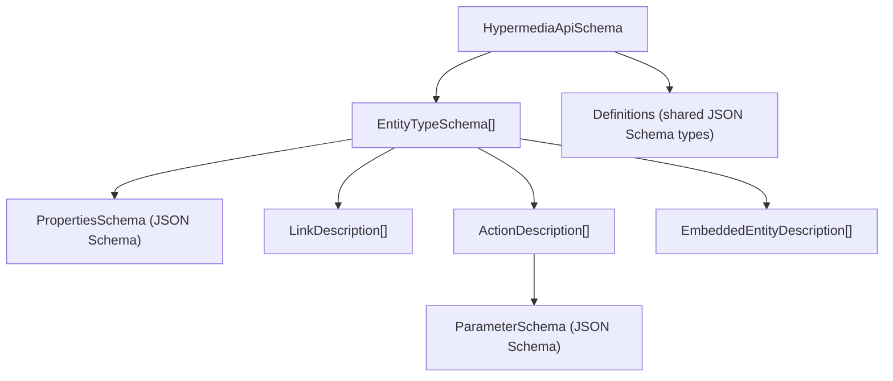
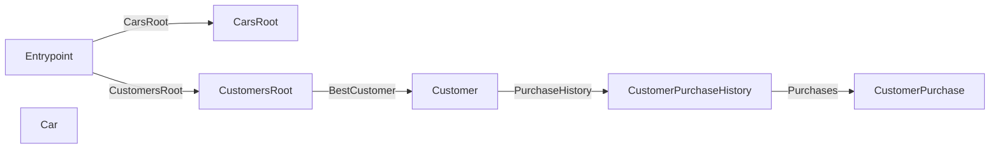

# Hypermedia API Schema

The `HypermediaApiSchema` is a type-level description of a RESTyard hypermedia API. It describes **what entity types exist**, **how they connect** (via links, actions, and embedded entities), and **what data they carry** — without including runtime URLs or instance-specific state.

It complements Siren responses: Siren tells the client what a *specific entity instance* looks like right now; the schema tells the client (or a tool) what *all entity types* look like in general.

## Who is this for?

- **Client generator authors** — generate typed clients from the schema
- **Documentation tool authors** — render API reference docs, diagrams
- **AI agents / MCP servers** — understand available actions, parameters, and navigation paths
- **API developers** — generate schema artifacts for documentation and CI

## Schema Overview



## Top-Level: `HypermediaApiSchema`

| Field | Type | Description |
|---|---|---|
| `schemaVersion` | `string` | Version of the schema format itself (e.g., `"1.0.0"`). Bumped when the schema structure changes. |
| `apiVersion` | `string?` | Version of the described API. Set via `HypermediaSchemaOptions.ApiVersion`. Null if not configured. |
| `title` | `string?` | Human-readable API title. Defaults to the entry assembly name if not set. |
| `description` | `string?` | Human-readable API description. Null if not configured. |
| `externalDocsUrl` | `string?` | URL to external documentation. Null if not configured. |
| `entryPointName` | `string` | Name of the entry point entity type (references `EntityTypeSchema.Name`). Auto-detected from entity types with Siren class `"EntryPoint"`, or empty if none found. |
| `entityTypes` | `EntityTypeSchema[]` | All entity types in the API. |
| `definitions` | `Dictionary<string, JsonSchema>` | Shared JSON Schema type definitions, referenced via `$ref` from property and parameter schemas. |
| `declaredAccessGroups` | `string[]?` | All access group names found across the API, collected automatically from `[HypermediaAccessGroup]` attributes. Null when none are declared. Useful for tooling (typo detection, UI dropdowns). |

**Example (from CarShack):**

```json
{
  "schemaVersion": "1.0.0",
  "title": "CarShack API",
  "description": "RESTyard demo API for managing cars and customers",
  "entryPointName": "Entrypoint",
  "entityTypes": [ ... ],
  "definitions": { }
}
```

## Entity Type: `EntityTypeSchema`

Describes one type of Siren entity — its data shape and hypermedia connections.

| Field | Type | Description |
|---|---|---|
| `name` | `string` | Unique identifier for cross-references. Derived from the C# class name (stripping `Hypermedia` prefix and `Hto` suffix). |
| `classes` | `string[]` | Siren classes that identify this entity type at runtime. Used for wire-format matching. |
| `title` | `string?` | From `[HypermediaObject(Title)]`, `[Title]` attribute, or XML doc `<summary>`. |
| `description` | `string?` | From `[Description]` attribute or XML doc `<remarks>`. |
| `propertiesSchema` | `JsonSchema?` | JSON Schema describing the Siren `properties` bag. Null for entities with no data properties. |
| `links` | `LinkDescription[]` | Hypermedia links this entity type exposes. |
| `actions` | `ActionDescription[]` | Hypermedia actions available on this entity type. |
| `embeddedEntities` | `EmbeddedEntityDescription[]` | Embedded sub-entities. |
| `accessGroups` | `string[]?` | Access groups from `[HypermediaAccessGroup]`. Null = public (no restriction). OR semantics: any matching group grants access. |
| `isDeprecated` | `bool` | `true` when the HTO class has `[Obsolete]`. |
| `deprecationMessage` | `string?` | The message from `[Obsolete("message")]`. |

**Example:**

```json
{
  "name": "Customer",
  "classes": ["Customer"],
  "propertiesSchema": {
    "type": "object",
    "properties": {
      "FullName": { "type": "string" },
      "Age": { "type": ["integer", "null"] },
      "IsFavorite": { "type": "boolean" }
    }
  },
  "links": [ ... ],
  "actions": [ ... ],
  "embeddedEntities": [],
  "isDeprecated": false
}
```

## Links: `LinkDescription`

Describes a hypermedia link from one entity type to another.

| Field | Type | Description |
|---|---|---|
| `relations` | `string[]` | Siren relation types from `[Relations]` (e.g., `["self"]`, `["bestFriend"]`). |
| `targetName` | `string?` | Name of the target entity type (references another `EntityTypeSchema.Name`). **Absent for external links** — the link points outside the API and has no entity type in the schema. |
| `targetClasses` | `string[]` | Siren classes of the target entity type. Empty for external links. |
| `isExternal` | `bool` | `true` for external links (`ExternalLink` properties). Explicit marker — consumers don't need to infer externality from a missing `targetName`. Omitted (false) for entity links. |
| `title` | `string?` | From `[Title]` attribute or XML doc `<summary>`. |
| `description` | `string?` | From `[Description]` attribute or XML doc `<remarks>`. |
| `accessGroups` | `string[]?` | Access groups from `[HypermediaAccessGroup]`. Null = public. |
| `isMandatory` | `bool` | `true` when the link property is non-nullable — always present on the entity. |
| `mediaTypes` | `string[]` | Media types the linked resource may be served as, from `[HypermediaMediaType]` (e.g., `["application/pdf", "text/html"]`). Defaults to `["application/vnd.siren+json"]` when not declared. |
| `isDeprecated` | `bool` | `true` when the link property has `[Obsolete]`. |
| `deprecationMessage` | `string?` | The message from `[Obsolete("message")]`. |

**Example:**

```json
{
  "relations": ["PurchaseHistory"],
  "targetName": "CustomerPurchaseHistory",
  "targetClasses": ["CustomerPurchaseHistory"],
  "mediaTypes": ["application/vnd.siren+json"],
  "isMandatory": true,
  "isDeprecated": false
}
```

### External Links

`ExternalLink` properties (resources outside the API, e.g. downloads or third-party pages) appear
as links with `isExternal: true` and **without** `targetName`/`targetClasses`. Dereferencing an
external link usually yields a non-Siren resource. The expected media type(s) can be declared with
`[HypermediaMediaType]` on the link property:

```csharp
[Relations(["invoice-document"])]
[HypermediaMediaType("application/pdf", "text/html")]
public ExternalLink Invoice { get; init; }
```

```json
{
  "relations": ["invoice-document"],
  "isExternal": true,
  "mediaTypes": ["application/pdf", "text/html"],
  "isMandatory": true,
  "isDeprecated": false
}
```

Without the attribute, `mediaTypes` defaults to `["application/vnd.siren+json"]` — correct for
entity links (targets are Siren resources), a placeholder for external links. Declare
`[HypermediaMediaType]` on external links whenever the target is not a Siren API.

In the Mermaid API map and class diagram, all external links point to a shared `External` node
(id `_external`) — external targets are visible in the graph but are not entity types.

## Actions: `ActionDescription`

Describes a hypermedia action (state transition) on an entity type.

| Field | Type | Description |
|---|---|---|
| `name` | `string` | Action name from `[HypermediaAction(Name)]` or the property name. |
| `title` | `string?` | Human-readable title from `[HypermediaAction(Title)]`, `[Title]`, or XML doc `<summary>`. |
| `description` | `string?` | From `[Description]` attribute or XML doc `<remarks>`. |
| `parameterSchema` | `JsonSchema?` | JSON Schema for the action's parameter type. Null for parameterless actions. |
| `contentType` | `string?` | Content type for the action request (e.g., `"multipart/form-data"` for file uploads). |
| `accessGroups` | `string[]?` | Access groups from `[HypermediaAccessGroup]`. Null = public. |
| `isMandatory` | `bool` | `true` when the action property is non-nullable. |
| `isFileUpload` | `bool` | `true` for `FileUploadHypermediaAction`. |
| `isDeprecated` | `bool` | `true` when the action property has `[Obsolete]`. |
| `deprecationMessage` | `string?` | The message from `[Obsolete("message")]`. |

**Example:**

```json
{
  "name": "CustomerMove",
  "title": "A Customer moved to a new location.",
  "parameterSchema": {
    "type": "object",
    "properties": {
      "Address": {
        "type": "object",
        "properties": {
          "Street": { "type": "string" },
          "City": { "type": "string" },
          "ZipCode": { "type": "string" }
        }
      }
    }
  },
  "isMandatory": true,
  "isFileUpload": false,
  "isDeprecated": false
}
```

## Embedded Entities: `EmbeddedEntityDescription`

Describes an embedded sub-entity within a parent entity type.

| Field | Type | Description |
|---|---|---|
| `relations` | `string[]` | Siren relation types from `[Relations]`. |
| `targetName` | `string` | Name of the embedded entity type (references `EntityTypeSchema.Name`). |
| `targetClasses` | `string[]` | Siren classes of the embedded entity type. |
| `isCollection` | `bool` | `true` when the property is a `List<IEmbeddedEntity<T>>` (collection of embedded entities). |
| `accessGroups` | `string[]?` | Access groups from `[HypermediaAccessGroup]`. Null = public. |
| `isMandatory` | `bool` | `true` when the property is non-nullable. |
| `title` | `string?` | From `[Title]` attribute or XML doc `<summary>`. |
| `description` | `string?` | From `[Description]` attribute or XML doc `<remarks>`. |
| `isDeprecated` | `bool` | `true` when the property has `[Obsolete]`. |
| `deprecationMessage` | `string?` | The message from `[Obsolete("message")]`. |

## Data Shapes and Definitions

Entity properties (`propertiesSchema`) and action parameters (`parameterSchema`) use standard [JSON Schema (Draft 2020-12)](https://json-schema.org/draft/2020-12/json-schema-core). Complex nested types (e.g., `Address`, `Pagination`) are automatically extracted to local `$defs` within each schema and referenced via `$ref`.

### Self-Contained Schemas

Each `propertiesSchema` and `parameterSchema` is a **valid, self-contained JSON Schema** — all `$ref` references resolve within the same document via local `$defs`. You can validate or process any individual schema without needing external context.

```json
{
  "type": "object",
  "$defs": {
    "address": { "type": "object", "properties": { "Street": { "type": "string" }, "City": { "type": "string" } } }
  },
  "properties": {
    "Name": { "type": "string" },
    "HomeAddress": { "$ref": "#/$defs/address" }
  }
}
```

### Top-Level `definitions` Catalog

The same complex types also appear in the top-level `HypermediaApiSchema.definitions` as a **deduplicated catalog**. If `Address` appears in both `Customer.propertiesSchema` and `Order.propertiesSchema`, it's listed once in `definitions`.

This catalog is useful for **tooling**:
- **Client generators**: iterate `definitions` first to generate one shared class per definition, then generate entity-specific code referencing the shared types. This avoids generating duplicate `Address` classes.
- **Documentation tools**: render a "Shared Types" section listing each definition with its properties.

The duplication (definitions in both local `$defs` and top-level `definitions`) is intentional — individual schemas remain self-contained and valid, while the catalog provides deduplication for tools that need it.

### JSON Schema Generation

The JSON Schema is generated at runtime by `IJsonSchemaFactory`, which supports:
- `[Title]` / `[Description]` attributes → JSON Schema `title` / `description` keywords
- `[DisplayName]` / `[Description]` from `System.ComponentModel` → `title` / `description`
- `[Obsolete]` → JSON Schema `deprecated: true`
- Non-nullable properties → listed in the `required` keyword (C# semantics: `string` is required,
  `string?` is optional; opt-out via `new JsonSchemaFactory(deriveRequiredFromNonNullable: false)`)
- Complex types → extracted to `$defs` with `$ref` (opt-out via `new JsonSchemaFactory(extractComplexTypesToDefs: false)`)
- Custom temporal type handling (`DateOnly`, `TimeOnly`, `DateTimeOffset`, `TimeSpan`)
- User-extensible via `IAttributeHandler` registration

## Entity Relationship Graph

The schema describes a graph of entity types connected by links, actions, and embedded entities. This graph can be visualized using the Mermaid API Map:



## Access Groups

Access groups describe which permissions are needed to see specific entity types, actions, links, or embedded entities. They are **purely descriptive metadata** — the server still enforces authorization at runtime.

### `[HypermediaAccessGroup]`

Declare access groups on HTO classes (entity types) and properties (actions, links, embedded entities):

```csharp
[HypermediaObject(Title = "Customer", Classes = ["Customer"])]
[HypermediaAccessGroup("customer")]
public class HypermediaCustomerHto : HypermediaObject
{
    [HypermediaAction(Name = "Delete")]
    [HypermediaAccessGroup("admin", "sales")]
    public HypermediaAction? Delete { get; set; }

    [Relations(["orders"])]
    [HypermediaAccessGroup("read")]
    public ILink<HypermediaOrdersHto>? Orders { get; set; }
}
```

**Semantics:** OR — `[HypermediaAccessGroup("admin", "sales")]` means *either* "admin" or "sales" grants access, not both required. Elements without the attribute are public (no restriction).

The source generator reads the attribute and populates `accessGroups` on `EntityTypeSchema`, `ActionDescription`, `LinkDescription`, and `EmbeddedEntityDescription`. All discovered group names are collected into `declaredAccessGroups` on the schema.

### Filtered Schema Endpoint

The `/hypermedia-schema` endpoint supports access group filtering via query parameters:

```
GET /hypermedia-schema                              → full schema
GET /hypermedia-schema?accessGroups=read,write       → include: elements visible to "read" or "write"
GET /hypermedia-schema?excludeAccessGroups=admin     → exclude: everything except "admin" elements
```

- **Include mode:** keeps elements where any access group matches the granted set, plus public elements
- **Exclude mode:** removes elements where any access group matches the excluded set
- Specifying both parameters returns `400 Bad Request`
- Entity types that become unreachable after filtering (no remaining links, embedded entities, or action results pointing to them) are removed automatically

### `ISchemaAccessGroupSanitizer`

Optional DI hook to control which access groups a user can query. Registered via DI — called before the filter is applied.

```csharp
public class RoleBasedSanitizer : ISchemaAccessGroupSanitizer
{
    public IReadOnlySet<string> SanitizeRequestedGroups(
        IReadOnlySet<string> requestedGroups, HttpContext httpContext)
    {
        if (!httpContext.User.IsInRole("admin"))
            return requestedGroups.Except(new[] { "admin" }).ToHashSet();
        return requestedGroups;
    }
}

builder.Services.AddSingleton<ISchemaAccessGroupSanitizer, RoleBasedSanitizer>();
```

When no sanitizer is registered, requested groups are passed through unchanged (schema is public).

### Access Groups Discovery Endpoint

Exposes the access groups available to the current user:

```csharp
app.MapHypermediaSchemaAccessGroups();
```

Returns `{ "accessGroups": ["read", "write"] }` at `GET /schema/access-groups` with content type `application/vnd.restyard.hypermedia-schema-access-groups+json`. Groups are filtered through `ISchemaAccessGroupSanitizer` if registered.

The route is configurable:

```csharp
app.MapHypermediaSchemaAccessGroups(o => o.Route = "/api/access-groups");
```

### Linking to Schema and Access Groups

Add discoverable links from your entry point HTO:

```csharp
public partial class HypermediaEntrypointHto
{
    [Relations(["schema"])]
    public ExternalLink Schema { get; init; } = HypermediaSchema.Link();

    [Relations(["schema-customer"])]
    public ExternalLink CustomerSchema { get; init; } = HypermediaSchema.Link(
        new HypermediaSchemaFilterParameters { AccessGroups = "customer" });

    [Relations(["access-groups"])]
    public ExternalLink AccessGroups { get; init; } = HypermediaSchemaAccessGroups.Link();
}
```

`HypermediaSchema.Link(HypermediaSchemaFilterParameters)` creates a link to the filtered schema. This also enables building a custom schema HTO with a filter action — the action handler can use `HypermediaSchema.Link(parameters)` to build the filtered URL and return it as a `Created` response with `Location` header.

## CLI Schema Generation

Generate schema artifacts from your server application. Use `--schema-help` for a full list of arguments:

```bash
myapp --schema-help

# Generate all artifacts
dotnet run --project MyApi -- --generate-schema --schema-output ./docs

# Generate only JSON schema
dotnet run --project MyApi -- --generate-schema --schema-artifacts json-hypermedia-api-schema --schema-output ./docs

# Generate with raw Mermaid (no Markdown wrapping)
dotnet run --project MyApi -- --generate-schema --schema-output ./docs --mermaid-wrap-markdown false

# Generate filtered by access groups
dotnet run --project MyApi -- --generate-schema --schema-output ./docs --access-groups read,write
dotnet run --project MyApi -- --generate-schema --schema-output ./docs --exclude-access-groups admin
```

### Available Artifacts

| CLI value | Output file | Description |
|---|---|---|
| `json-hypermedia-api-schema` | `hypermedia-api-schema.json` | Full schema as JSON |
| `mermaid-api-map` | `api-map.md` | Entity relationship graph (Mermaid) |
| `mermaid-htos` | `htos.md` | HTO class diagram with properties/actions (Mermaid) |
| `markdown-api-documentation` | `api-documentation.md` | Full Markdown API reference |

### Mapper Options

| CLI arg | Default | Description |
|---|---|---|
| `--mermaid-include-properties` | `true` | Include properties in HTO diagram |
| `--mermaid-include-actions` | `true` | Include actions in HTO diagram |
| `--mermaid-wrap-markdown` | `true` | Wrap Mermaid in Markdown with title and code fence |
| `--markdown-include-toc` | `true` | Include table of contents |
| `--markdown-include-diagram` | `true` | Include Mermaid diagram in Markdown |

### Access Group Filtering

| CLI arg | Description |
|---|---|
| `--access-groups <groups>` | Include mode: comma-separated, keep elements visible to any of these groups |
| `--exclude-access-groups <groups>` | Exclude mode: comma-separated, remove elements matching any of these groups |

Mutually exclusive — specifying both results in an error. No `ISchemaAccessGroupSanitizer` is applied in CLI mode — the caller is trusted.

## Schema Endpoint

Serve the schema at runtime via a minimal API endpoint:

```csharp
app.MapHypermediaSchema();
```

This maps a `GET /hypermedia-schema` endpoint that returns the full `HypermediaApiSchema` as JSON with content type `application/vnd.restyard.hypermedia-schema+json`.

**Custom route:**

```csharp
app.MapHypermediaSchema(o => o.Route = "/api/schema");
```

**Authorization:** Since `MapHypermediaSchema()` returns an `IEndpointConventionBuilder`, you can chain standard minimal API policies:

```csharp
app.MapHypermediaSchema().RequireAuthorization("AdminOnly");
```

Make sure `AddHypermediaSchema()` was called during service registration to enable the schema feature.

### Linking to the Schema from the Entry Point

Add a discoverable link from your API's entry point HTO to the schema endpoint using the `ToSchema()` helper:

```csharp
public partial class HypermediaEntrypointHto
{
    [Relations(["schema"])]
    public ExternalLink Schema { get; init; } = HypermediaSchema.Link();
}
```

This creates an internal link resolved by the framework to `/hypermedia-schema` (or your custom route) with the correct media type `application/vnd.restyard.hypermedia-schema+json`. Clients can follow the `schema` relation from the entry point to discover the full API schema.

## Programmatic Access

### ASP.NET Core

```csharp
// Register schema services
builder.Services.AddHypermediaSchema(o =>
{
    o.Title = "My API";
    o.Description = "My hypermedia API";
    o.ApiVersion = "1.0.0";
});

// Generate schema on CLI request
var app = builder.Build();
if (app.GenerateSchemaIfRequested(args)) return;
app.Run();
```

### Tooling (no ASP.NET Core)

```csharp
var factory = new JsonSchemaFactory();
var schema = HypermediaSchemaBuilder.Build(factory, new HypermediaSchemaOptions
{
    Title = "My API",
    ApiVersion = "1.0.0",
});

// Generate files
HypermediaSchemaGenerator.Generate(schema, "./output", SchemaOutputFormats.All);

// Or serialize directly
var json = schema.ToJson();

// Deserialize from JSON
var loaded = HypermediaApiSchema.FromJson(json);
```
