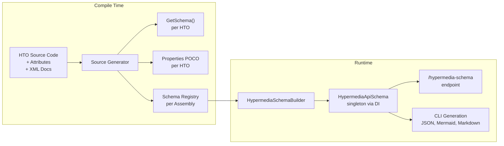

# RESTyard Source Generator — Server Developer Guide

The RESTyard source generator automatically produces schema metadata from your HTO (HypermediaTypedObject) classes at compile time. No reflection at runtime, no manual schema authoring.

## Getting Started

### 1. Add the assembly attribute

In any `.cs` file in your HTO assembly (e.g., `Program.cs` or a dedicated `AssemblyInfo.cs`):

```csharp
using RESTyard.AspNetCore.Hypermedia.Attributes;

[assembly: HypermediaAssembly]
```

This single attribute:
- Enables source generation for the assembly
- Makes the assembly discoverable via `HypermediaAssemblyDiscovery.GetAssemblies()`
- Generates `GetSchema()` methods, properties POCOs, and a schema registry

Without this attribute, the source generator emits nothing — even if the NuGet package is referenced.

### 2. Reference the source generator

The source generator is **bundled in the `RESTyard.AspNetCore` NuGet package** alongside the existing analyzers. If you reference `RESTyard.AspNetCore` via NuGet, the source generator is included automatically — no additional package needed.

For development with project references (e.g., in the RESTyard solution itself), add the generator as an analyzer reference:

```xml
<ProjectReference Include="..\RESTyard.HtoSourceGenerators\RESTyard.HtoSourceGenerators.csproj"
                  OutputItemType="Analyzer" ReferenceOutputAssembly="false" />
```

### 3. Register the schema (optional)

To serve the schema at runtime or generate CLI artifacts:

```csharp
using RESTyard.Schema;

builder.Services.AddHypermediaSchema(o =>
{
    o.Title = "My API";
    o.ApiVersion = "1.0.0";
});
```

## How It Works

At **compile time**, the source generator reads your HTO classes (attributes, XML doc comments) and emits schema methods, properties POCOs, and a per-assembly registry. At **runtime**, the registry is discovered automatically, and the schema is aggregated into a singleton `HypermediaApiSchema` available via DI — consumed by the schema endpoint and CLI generation.



## What Gets Generated

For each HTO class — `record` HTOs are supported too — with `[HypermediaObject]`, the generator produces:

| Generated file | Contains | Purpose |
|---|---|---|
| `{ClassName}SirenMapper.g.cs` | `GetSchema()` static method | Returns `EntityTypeSchema` with all metadata |
| `{ClassName}Properties.g.cs` | Properties POCO class | Data properties with forwarded attributes, used by schema generation and future `ToSiren()` |
| `HypermediaSchemaRegistry.g.cs` | Per-assembly registry + `[assembly: HypermediaSchemaRegistryAttribute]` | Collects all `GetSchema()` calls for runtime discovery |

### Example: what the generator sees and produces

Given this HTO:

```csharp
/// <summary>A customer in the system.</summary>
[HypermediaObject(Title = "Customer", Classes = ["Customer"])]
public class HypermediaCustomerHto : HypermediaObject
{
    [HypermediaProperty(Name = "FullName")]
    public string Name { get; set; } = string.Empty;

    public int Age { get; set; }

    [Relations(["bestFriend"])]
    public ILink<HypermediaCustomerHto>? BestFriend { get; set; }

    [HypermediaAction(Name = "MarkAsFavorite", Title = "Mark as favorite")]
    public MarkAsFavoriteAction? MarkAsFavorite { get; set; }
}
```

The generator produces:

**Properties POCO** (`HypermediaCustomerHtoProperties.g.cs`):
```csharp
public class HypermediaCustomerHtoProperties
{
    public string FullName { get; set; } = default!;  // renamed from Name
    public int Age { get; set; } = default!;
    // Links, actions, embedded entities excluded
}
```

**Schema method** (`HypermediaCustomerHtoSirenMapper.g.cs`):
```csharp
public static EntityTypeSchema GetSchema(IJsonSchemaFactory schemaFactory)
{
    var propertiesSchema = schemaFactory.Generate(typeof(HypermediaCustomerHtoProperties));

    return new EntityTypeSchema
    {
        Name = "Customer",
        Title = "Customer",
        Description = "A customer in the system.",  // from XML doc <summary>
        Classes = new[] { "Customer" },
        PropertiesSchema = propertiesSchema,
        Links = new LinkDescription[] { ... },
        Actions = new ActionDescription[] { ... },
    };
}
```

## Attribute Reference

### `[HypermediaAssembly]`

Assembly-level attribute that enables source generation and assembly discovery.

| Property | Default | Description |
|---|---|---|
| `Schema` | `true` | Generate schema code (`GetSchema()`, Properties POCO, registry). Set `false` as a safety hatch to disable generation without removing the attribute. |
| `Siren` | `false` | Generate `ToSiren()` mappers (future — Phase 6). |

```csharp
[assembly: HypermediaAssembly]                        // schema only (default)
[assembly: HypermediaAssembly(Siren = true)]          // schema + ToSiren()
[assembly: HypermediaAssembly(Schema = false)]        // discovery only, no generation
```

### `[HypermediaSchemaName]` — Entity Names and Collisions

The schema name of an entity type is derived from the class name by stripping the `Hypermedia`
prefix and `Hto` suffix: `HypermediaCustomerHto` → `Customer`. It is the identifier used in schema
cross-references (`targetName` on links and embedded entities, `resultName` on actions), Mermaid
diagrams, and Markdown documentation.

Because of the stripping, different classes can derive the same name — `HypermediaCustomerHto` and
`CustomerHto` both become `Customer`. Within one assembly this is reported as **error RY0024**
(cross-references would silently point at the wrong entity). Resolve it with
`[HypermediaSchemaName]` (`RESTyard.Schema.Model`) on one of the classes:

```csharp
[HypermediaObject(Title = "Customer", Classes = ["Customer"])]
[HypermediaSchemaName("CrmCustomer")]
public class HypermediaCustomerHto : IHypermediaObject { ... }
```

The override applies everywhere the name is used — entity name and all cross-references pointing
at the type stay consistent. It is also useful without a collision, e.g. for shorter names in
documentation and diagrams. Cross-assembly collisions cannot be detected at compile time; they
surface when the aggregated schema is composed at runtime.

### Record HTOs

`record` HTOs work like class HTOs: positional (primary-constructor) properties and body
properties become data properties; the compiler-generated `EqualityContract` is excluded.
Note that a `record` cannot derive from the (obsolete) `HypermediaObject` base class — implement
`IHypermediaObject` directly.

### Embedded Entity Collections

A property counts as an embedded entity collection when its type is an array of
`IEmbeddedEntity<THto>` or implements `IEnumerable<IEmbeddedEntity<THto>>` (`List<>`, `IList<>`,
`IReadOnlyList<>`, ...). Other generic types over an embedded entity
(`Func<IEmbeddedEntity<T>>`, `Dictionary<IEmbeddedEntity<T>, X>`) are **not** embedded entities —
they are treated as ordinary data properties. This matches the runtime `SirenConverter`.

### Null Handling in `ToSiren()`

Nullability annotations decide whether a link, action, or embedded-entity property is mandatory.
A mandatory member is **always on the wire** — that is what `isMandatory: true` in the schema
guarantees to consumers:

- **Non-nullable** (`ILink<T>`, `MyOp`, `IEmbeddedEntity<T>`): a null value throws
  `InvalidOperationException` at render time. For actions, `CanExecute()` returning false
  **also throws** — a mandatory action must always be available.
- **Nullable** (`ILink<T>?`, `MyOp?`, `IEmbeddedEntity<T>?`): a null value silently omits the
  member. A nullable action is additionally gated by `CanExecute()` — returning false omits it
  without error. Declare the property nullable whenever the action can be absent.

In `#nullable disable` contexts nothing is annotated, so every such property counts as mandatory.
Enable nullable reference types and mark optional members with `?`.

### Title and Description Harvesting

The generator extracts title and description for entity types, links, actions, and embedded entities:

| Source | Priority | Maps to |
|---|---|---|
| `[HypermediaObject(Title)]` | 1st (entity title) | `EntityTypeSchema.Title` |
| `[HypermediaAction(Title)]` | 1st (action title) | `ActionDescription.Title` |
| `[Title("...")]` (`JsonSchema.Net.Generation`) | 2nd | Title on any element |
| XML doc `<summary>` | 3rd (fallback) | Title on any element |
| `[Description("...")]` (`JsonSchema.Net.Generation`) | 1st | Description on any element |
| XML doc `<remarks>` | 2nd (fallback) | Description on any element |

### Deprecation

`[Obsolete("message")]` on HTO classes, link properties, action properties, or embedded entity properties maps to `IsDeprecated = true` and `DeprecationMessage` in the schema.

On properties within the generated Properties POCO (entity data properties and action parameter members), `[Obsolete]` produces JSON Schema `deprecated: true` via the registered `ObsoleteAttributeHandler`.

### Access Groups

`[HypermediaAccessGroup("group1", "group2")]` on HTO classes, action properties, link properties, or embedded entity properties maps to `AccessGroups` in the schema. Accepts `params string[]`.

**Semantics:** OR — any matching group grants access. Elements without the attribute are public.

```csharp
[HypermediaObject(Title = "Admin", Classes = ["Admin"])]
[HypermediaAccessGroup("admin")]
public class HypermediaAdminHto : HypermediaObject
{
    [HypermediaAction(Name = "Delete")]
    [HypermediaAccessGroup("admin", "sales")]
    public HypermediaAction? Delete { get; set; }
}
```

All discovered group names are collected into `HypermediaApiSchema.DeclaredAccessGroups` automatically.

### External Links and `[HypermediaMediaType]`

`ExternalLink` properties (resources outside the API) are included in the schema as links without
`targetName`/`targetClasses`. Like HTO-targeted links they need `[Relations]` (RY0021 warns otherwise).
The expected media type(s) of the linked resource can be declared with `[HypermediaMediaType]`
(`RESTyard.Schema.Model`) and are emitted as `mediaTypes`:

```csharp
[Relations(["invoice-document"])]
[HypermediaMediaType("application/pdf", "text/html")]
public ExternalLink Invoice { get; init; }
```

Links without the attribute get `mediaTypes: ["application/vnd.siren+json"]` in the schema —
the correct default for entity links.

**Interaction with the generated Siren mapper.** The generated `ToSiren()` uses the declared media
types as the link `type` when the reference sets none at runtime. Precedence:

1. Runtime media types (`WithAvailableMediaType(s)` on the reference) — always win.
2. Declared `[HypermediaMediaType]` values.
3. Neither → `type` is omitted. Plain navigation links carry no `type` on the wire — Siren is the
   baseline, and the schema states the default once via `mediaTypes`.

When a link property declares media types and the runtime reference returns a media type outside
that list, the mapper reacts per `SirenMapperOptions.MediaTypeMismatch`:

| Behavior | Effect |
|---|---|
| `Warn` (default) | Calls `SirenMapperOptions.MediaTypeMismatchWarningHandler` (defaults to `Trace.TraceWarning`); response is unchanged. |
| `Throw` | Throws `InvalidOperationException` — useful in integration tests. |
| `Ignore` | No check. |

Links without `[HypermediaMediaType]` are never validated. Route the warning into your logging
with `options.MediaTypeMismatchWarningHandler = msg => logger.LogWarning(msg);`.
The legacy reflection-based `SirenConverter` is unchanged: it only emits runtime media types.

### Property Handling

| Attribute | Effect in generated POCO |
|---|---|
| `[HypermediaProperty(Name = "x")]` | Property renamed to `x` (structural) |
| `[FormatterIgnoreHypermediaProperty]` | Property excluded entirely |
| `[Key]` | Property included (it's a data property), `[Key]` attribute not forwarded |
| `[JsonConverter]`, `[JsonPropertyName]`, etc. | Forwarded verbatim |
| `[Title]`, `[Description]`, `[Obsolete]` | Forwarded verbatim |
| `[Relations]`, `[HypermediaAction]`, `[HypermediaAccessGroup]` | Not forwarded (consumed by generator) |

### JSON Schema on Properties

The following attributes on data properties and action parameter members are picked up by the default `JsonSchemaFactory` implementation (using `JsonSchema.Net`) at runtime. Custom `IJsonSchemaFactory` implementations may handle these differently.

| Attribute | JSON Schema keyword |
|---|---|
| `[Title("...")]` | `title` |
| `[Description("...")]` | `description` |
| `[DisplayName("...")]` (`System.ComponentModel`) | `title` |
| `[Description("...")]` (`System.ComponentModel`) | `description` |
| `[Obsolete]` | `deprecated: true` |

**Nullability → `required`:** non-nullable properties are listed in the schema's `required` keyword
(`string Name` is required, `string? Nickname` is optional). Nullable reference annotations from the
HTO are preserved in the generated POCO, so `required` reflects your HTO declarations. The C# `required`
keyword is merged in. Opt out with `new JsonSchemaFactory(deriveRequiredFromNonNullable: false)`.

## Assembly Discovery

Instead of manually listing assemblies, use the auto-discovery helper:

```csharp
builder.Services.AddHypermediaExtensions(o =>
{
    o.ControllerAndHypermediaAssemblies = HypermediaAssemblyDiscovery.GetAssemblies();
});
```

This scans all loaded assemblies for `[HypermediaAssembly]`. Both HTO assemblies **and** controller assemblies should have the attribute — even if a controller assembly contains no HTOs. This is required for:
- Assembly discovery via `HypermediaAssemblyDiscovery.GetAssemblies()`
- Source generator to scan controller attributes (e.g., `ResultType` on `[HypermediaActionEndpoint]`)
- Multi-assembly scenarios where HTOs and controllers are in separate projects

### Action Result Types

When an action endpoint produces a `Location` header pointing to another entity (e.g., a query action returning a result entity), declare the result type on the action endpoint:

```csharp
[HypermediaActionEndpoint<HypermediaCustomersRootHto>("CreateQuery",
    ResultType = typeof(HypermediaCustomerQueryResultHto))]
public IActionResult CreateQuery([FromBody] CustomerQuery query)
{
    // ... returns Created with Location header pointing to CustomerQueryResult
}
```

This populates `ActionDescription.ResultName` in the schema, enabling:
- "Returns: [CustomerQueryResult](#customerqueryresult)" in generated Markdown documentation
- Incoming "Referenced by" links on the target entity
- Action-result edges in API diagrams

**If `ResultType` is not set**, the schema is still valid but incomplete — client generators and documentation tools won't know that the action produces a specific entity. They cannot generate typed result handling code or render result links.

**If `ResultType` is set to a non-HTO type** (a class without `[HypermediaObject]`), the generator emits warning `RY0032`. The schema cannot describe non-hypermedia result types — `ResultName`/`ResultClasses` will not be populated. If the action intentionally returns a non-hypermedia resource (e.g., a file download URL), suppress the warning or remove `ResultType`.

**Legacy attributes:** `ResultType` also works on the legacy `[Http*HypermediaAction]` attributes (e.g., `[HttpPostHypermediaAction]`). If your project uses the contract-first generator, you can add `ResultType` to the generated controller attributes manually:

```csharp
[HttpPostHypermediaAction("<stub>", typeof(HypermediaCustomersRootHto.CreateQueryOp),
    ResultType = typeof(HypermediaCustomerQueryResultHto))]
public Task<IActionResult> CreateQueryAsync(...) { ... }
```

## Minimal API Endpoints

Minimal API endpoints can serve as HTO and action endpoints by attaching RESTyard metadata via `.WithMetadata()`:

```csharp
// HTO endpoint
app.MapGet("/customers/{id}", (int id) => { ... })
   .WithMetadata(new HypermediaObjectEndpointAttribute<HypermediaCustomerHto>(typeof(CustomerRouteKeyProducer)));

// Action endpoint
app.MapPost("/customers", ([FromBody] CreateCustomerParameters parameters) => { ... })
   .WithMetadata(new HypermediaActionEndpointAttribute<HypermediaCustomersRootHto>("CreateCustomer"));
```

The route resolver discovers these endpoints via ASP.NET Core's `ApiExplorer`, which includes both controller and minimal API endpoints.

**Limitation:** `ResultType` is not supported on minimal API endpoints. The source generator reads `ResultType` from controller method attributes at compile time — `.WithMetadata()` calls are runtime code and invisible to the generator. Use controllers when `ResultType` is needed, or declare result types on HTO action properties directly (future enhancement).

## Verifying Generation Works

After adding `[assembly: HypermediaAssembly]` and building:

1. **Check generated files** — In your IDE, look under Dependencies > Analyzers > RESTyard.HtoSourceGenerators. You should see `*SirenMapper.g.cs`, `*Properties.g.cs`, and `HypermediaSchemaRegistry.g.cs`.

2. **Build output** — Generated files appear in `obj/Debug/<tfm>/generated/RESTyard.HtoSourceGenerators/`.

3. **Run schema generation** — The quickest verification:
   ```bash
   dotnet run -- --generate-schema --schema-output ./test-output
   ```
   If `hypermedia-api-schema.json` is produced and contains your entity types, everything works.

## Troubleshooting

| Problem | Cause | Fix |
|---|---|---|
| No generated files | Missing `[assembly: HypermediaAssembly]` | Add the attribute to your HTO assembly |
| No generated files | Source generator not referenced | Add the analyzer project/NuGet reference |
| Empty schema (no entity types) | `Schema = false` on the attribute | Remove `Schema = false` or set to `true` |
| `RY0020` warning | `IEmbeddedEntity<T>` property missing `[Relations]` | Add `[Relations(["rel"])]` to the property |
| `RY0021` warning | `ILink<T>` property missing `[Relations]` | Add `[Relations(["rel"])]` to the property |
| `RY0024` error | Two HTOs derive the same schema name | Apply `[HypermediaSchemaName]` to one of them |
| `RY0030` warning | `Siren = true` with `Schema = false` | `Schema` is forced to `true` (Siren needs the Properties POCO) |
| `RY0032` warning | `ResultType` is not a `[HypermediaObject]` | Schema can't describe non-HTO results. Suppress if intentional, or remove `ResultType`. |
| Properties POCO has wrong name | `[HypermediaProperty(Name)]` not applied | Verify the attribute is on the HTO property |
| Attribute not forwarded to POCO | It's a RESTyard attribute | `[Key]`, `[Relations]`, `[HypermediaAction]`, `[HypermediaProperty]`, `[FormatterIgnoreHypermediaProperty]` are consumed by the generator, not forwarded |
