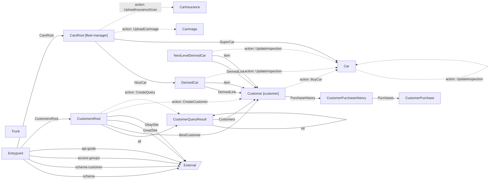

# CarShack API

RESTyard demo API for managing cars and customers

**Version:** 1.2.3

**Entry Point:** [Entrypoint](#entrypoint)

## Table of Contents

- [Entrypoint](#entrypoint)
- [CustomersRoot](#customersroot)
- [CarsRoot](#carsroot)
- [CustomerQueryResult](#customerqueryresult)
- [Customer](#customer)
- [DerivedCar](#derivedcar)
- [Car](#car)
- [CustomerPurchaseHistory](#customerpurchasehistory)
- [CustomerPurchase](#customerpurchase)
- [Truck](#truck)
- [CarImage](#carimage)
- [CarInsurance](#carinsurance)
- [NextLevelDerivedCar](#nextlevelderivedcar)

**Definitions**

- [Country](#definition-country)
- [Pagination](#definition-pagination)
- [SortParameter<CustomerSortProperties>](#definition-sortparameterofcustomersortproperties)
- [CustomerFilter](#definition-customerfilter)
- [AddressTo](#definition-addressto)

**Access Groups**

- [customer](#access-group-customer)
- [fleet-manager](#access-group-fleet-manager)

## API Map

## Entrypoint

#### Classes

- `Entrypoint`

### Links

| Relation | Target | Access Groups | Description |
|---|---|---|---|
| schema | *external* (`application/vnd.siren+json`) |  |  |
| schema-customer | *external* (`application/vnd.siren+json`) |  |  |
| access-groups | *external* (`application/vnd.siren+json`) |  |  |
| api-guide | *external* (`application/vnd.siren+json`) |  |  |
| CustomersRoot | [CustomersRoot](#customersroot) |  |  |
| CarsRoot | [CarsRoot](#carsroot) |  |  |
| self | [Entrypoint](#entrypoint) |  |  |

## CustomersRoot

#### Classes

- `CustomersRoot`

### Links

| Relation | Target | Access Groups | Description |
|---|---|---|---|
| all | [CustomerQueryResult](#customerqueryresult) |  |  |
| BestCustomer | [Customer](#customer) |  |  |
| GreatSite | *external* (`application/vnd.siren+json`) |  |  |
| OkaySite *(optional)* | *external* (`application/vnd.siren+json`) |  |  |
| self | [CustomersRoot](#customersroot) |  |  |

### Actions

#### CreateCustomer

Request creation of a new Customer.

**Returns:** [Customer](#customer)

**Parameters:**

| Parameter | Type | Required | Description |
|---|---|---|---|
| Name | string | yes |  |
| Age | integer | no |  |

#### CreateQuery

Query the Customers collection.

**Returns:** [CustomerQueryResult](#customerqueryresult)

**Parameters:**

| Parameter | Type | Required | Description |
|---|---|---|---|
| Pagination | [Pagination](#definition-pagination) | yes |  |
| SortBy | [SortParameter<CustomerSortProperties>](#definition-sortparameterofcustomersortproperties) | yes |  |
| Filter | [CustomerFilter](#definition-customerfilter) | yes |  |

**Referenced by:**

- [Entrypoint](#entrypoint-links) (link: CustomersRoot)

## CarsRoot

#### Classes

- `CarsRoot`

**Access Groups:** [fleet-manager](#access-group-fleet-manager)

### Links

| Relation | Target | Access Groups | Description |
|---|---|---|---|
| NiceCar | [DerivedCar](#derivedcar) |  |  |
| SuperCar | [Car](#car) |  |  |
| self | [CarsRoot](#carsroot) |  |  |

### Actions

#### UploadCarImage

Upload image for car

**Returns:** [CarImage](#carimage)

**File upload** (`multipart/form-data`)

**Parameters:**

| Parameter | Type | Required | Description |
|---|---|---|---|
| Text | string | yes |  |
| Flag | boolean | yes |  |

#### UploadInsuranceScan

Upload scan of insurance for the car

**Returns:** [CarInsurance](#carinsurance)

**File upload** (`multipart/form-data`)

**Referenced by:**

- [Entrypoint](#entrypoint-links) (link: CarsRoot)

## CustomerQueryResult

#### Classes

- `CustomersQueryResult`

### Properties

| Property | Type | Required | Description |
|---|---|---|---|
| TotalEntities | integer | no |  |
| CurrentEntitiesCount | integer | no |  |

### Links

| Relation | Target | Access Groups | Description |
|---|---|---|---|
| Next *(optional)* | [CustomerQueryResult](#customerqueryresult) |  |  |
| Previous *(optional)* | [CustomerQueryResult](#customerqueryresult) |  |  |
| Last *(optional)* | [CustomerQueryResult](#customerqueryresult) |  |  |
| All *(optional)* | [CustomerQueryResult](#customerqueryresult) |  |  |
| self | [CustomerQueryResult](#customerqueryresult) |  |  |

### Embedded Entities

| Relation | Target | Collection | Access Groups | Description |
|---|---|---|---|---|
| Customers | [Customer](#customer) | yes |  |  |

**Referenced by:**

- [CustomersRoot](#customersroot-links) (link: all)
- [CustomersRoot → CreateQuery](#customersroot-createquery) (action result)
- [CustomerQueryResult](#customerqueryresult-links) (link: Next)
- [CustomerQueryResult](#customerqueryresult-links) (link: Previous)
- [CustomerQueryResult](#customerqueryresult-links) (link: Last)
- [CustomerQueryResult](#customerqueryresult-links) (link: All)

## Customer

#### Classes

- `Customer`

**Access Groups:** [customer](#access-group-customer)

### Properties

| Property | Type | Required | Description |
|---|---|---|---|
| Age | integer | no |  |
| FullName | string | no |  |
| Address | [AddressTo](#definition-addressto) | no |  |
| IsFavorite | boolean | yes |  |

### Links

| Relation | Target | Access Groups | Description |
|---|---|---|---|
| PurchaseHistory | [CustomerPurchaseHistory](#customerpurchasehistory) |  |  |
| self | [Customer](#customer) |  |  |

### Actions

#### CustomerMove

A Customer moved to a new location.

**Parameters:**

| Parameter | Type | Required | Description |
|---|---|---|---|
| Address | [AddressTo](#definition-addressto) | yes |  |

#### CustomerRemove

Remove a Customer.

#### MarkAsFavorite

Marks a Customer as a favorite buyer.

**Parameters:**

| Parameter | Type | Required | Description |
|---|---|---|---|
| Customer | string | yes | Format: `uri` |

#### BuyCar

Buy a car.

**Returns:** [Car](#car)

**Parameters:**

| Parameter | Type | Required | Description |
|---|---|---|---|
| Brand | string | yes |  |
| CarId | integer | yes |  |
| Price | number | no |  |
| HiddenProperty | number | no |  |

**Referenced by:**

- [DerivedCar](#derivedcar-links) (link: DerivedLink)
- [DerivedCar](#derivedcar-embedded) (embedded: item)
- [NextLevelDerivedCar](#nextlevelderivedcar-links) (link: DerivedLink)
- [NextLevelDerivedCar](#nextlevelderivedcar-embedded) (embedded: item)
- [CustomersRoot](#customersroot-links) (link: BestCustomer)
- [CustomersRoot → CreateCustomer](#customersroot-createcustomer) (action result)
- [CustomerQueryResult](#customerqueryresult-embedded) (embedded: Customers)

## DerivedCar

#### Classes

- `DerivedCar`

### Properties

| Property | Type | Required | Description |
|---|---|---|---|
| DerivedProperty | string | no |  |
| Id | integer | no |  |
| Brand | string | no |  |
| PriceDevelopment | number[] | no |  |
| PopularCountries | [Country](#definition-country)[] | no |  |
| MostPopularIn | [Country](#definition-country) | no |  |
| LastInspection | string | no | Format: `date` |

### Links

| Relation | Target | Access Groups | Description |
|---|---|---|---|
| DerivedLink *(optional)* | [Customer](#customer) |  |  |
| self | [DerivedCar](#derivedcar) |  |  |

### Actions

#### DerivedOperation

Derived Operation

#### UpdateInspection

**Returns:** [Car](#car)

**Parameters:**

| Parameter | Type | Required | Description |
|---|---|---|---|
| NewInspection | string | yes | Format: `date` |

### Embedded Entities

| Relation | Target | Collection | Access Groups | Description |
|---|---|---|---|---|
| item | [Customer](#customer) | yes |  |  |

**Referenced by:**

- [CarsRoot](#carsroot-links) (link: NiceCar)

## Car

#### Classes

- `Car`

### Properties

| Property | Type | Required | Description |
|---|---|---|---|
| Id | integer | no |  |
| Brand | string | no |  |
| PriceDevelopment | number[] | no |  |
| PopularCountries | [Country](#definition-country)[] | no |  |
| MostPopularIn | [Country](#definition-country) | no |  |
| LastInspection | string | no | Format: `date` |

### Links

| Relation | Target | Access Groups | Description |
|---|---|---|---|
| self | [Car](#car) |  |  |

### Actions

#### UpdateInspection

**Returns:** [Car](#car)

**Parameters:**

| Parameter | Type | Required | Description |
|---|---|---|---|
| NewInspection | string | yes | Format: `date` |

**Referenced by:**

- [CarsRoot](#carsroot-links) (link: SuperCar)
- [Car → UpdateInspection](#car-updateinspection) (action result)
- [DerivedCar → UpdateInspection](#derivedcar-updateinspection) (action result)
- [NextLevelDerivedCar → UpdateInspection](#nextlevelderivedcar-updateinspection) (action result)
- [Customer → BuyCar](#customer-buycar) (action result)

## CustomerPurchaseHistory

#### Classes

- `CustomerPurchaseHistory`

### Links

| Relation | Target | Access Groups | Description |
|---|---|---|---|
| self | [CustomerPurchaseHistory](#customerpurchasehistory) |  |  |

### Embedded Entities

| Relation | Target | Collection | Access Groups | Description |
|---|---|---|---|---|
| Purchases | [CustomerPurchase](#customerpurchase) | yes |  |  |

**Referenced by:**

- [Customer](#customer-links) (link: PurchaseHistory)

## CustomerPurchase

#### Classes

- `CustomerPurchase`

### Properties

| Property | Type | Required | Description |
|---|---|---|---|
| Amount | integer | no |  |
| CardNumber | string | yes |  |
| CardType | string | yes |  |

**Referenced by:**

- [CustomerPurchaseHistory](#customerpurchasehistory-embedded) (embedded: Purchases)

## Truck

#### Title

Truck

#### Description

A truck offered by the car shack.

Has no route; links to it resolve to the default route.

#### Classes

- `Truck`

### Properties

| Property | Type | Required | Description |
|---|---|---|---|
| Brand | string | yes |  |
| Id | integer | yes |  |

## CarImage

#### Classes

- `CarImage`

### Links

| Relation | Target | Access Groups | Description |
|---|---|---|---|
| self | [CarImage](#carimage) |  |  |

**Referenced by:**

- [CarsRoot → UploadCarImage](#carsroot-uploadcarimage) (action result)

## CarInsurance

#### Classes

- `CarInsurance`

### Links

| Relation | Target | Access Groups | Description |
|---|---|---|---|
| self | [CarInsurance](#carinsurance) |  |  |

**Referenced by:**

- [CarsRoot → UploadInsuranceScan](#carsroot-uploadinsurancescan) (action result)

## NextLevelDerivedCar

#### Classes

- `NextLevelDerivedCar`

### Properties

| Property | Type | Required | Description |
|---|---|---|---|
| NextLevelDerivedProperty | string | no |  |
| DerivedProperty | string | no |  |
| Id | integer | no |  |
| Brand | string | no |  |
| PriceDevelopment | number[] | no |  |
| PopularCountries | [Country](#definition-country)[] | no |  |
| MostPopularIn | [Country](#definition-country) | no |  |
| LastInspection | string | no | Format: `date` |

### Links

| Relation | Target | Access Groups | Description |
|---|---|---|---|
| self | [NextLevelDerivedCar](#nextlevelderivedcar) |  |  |
| DerivedLink *(optional)* | [Customer](#customer) |  |  |

### Actions

#### DerivedOperation

Derived Operation

#### UpdateInspection

**Returns:** [Car](#car)

**Parameters:**

| Parameter | Type | Required | Description |
|---|---|---|---|
| NewInspection | string | yes | Format: `date` |

### Embedded Entities

| Relation | Target | Collection | Access Groups | Description |
|---|---|---|---|---|
| item | [Customer](#customer) | yes |  |  |

## Definitions

### Definition: Country

**Referenced by:**

- [Car](#car)
- [DerivedCar](#derivedcar)
- [NextLevelDerivedCar](#nextlevelderivedcar)

| Property | Type | Required | Description |
|---|---|---|---|
| Name | string | yes |  |
| EstimatedPopulation | integer | yes |  |
| LanguageCode | string | yes |  |

### Definition: Pagination

**Referenced by:**

- [CustomersRoot → CreateQuery](#customersroot-createquery)

| Property | Type | Required | Description |
|---|---|---|---|
| PageSize | integer | yes |  |
| PageOffset | integer | yes |  |

### Definition: SortParameter<CustomerSortProperties>

**Referenced by:**

- [CustomersRoot → CreateQuery](#customersroot-createquery)

| Property | Type | Required | Description |
|---|---|---|---|
| PropertyName | object | no | Values: `Age`, `Name`, `null` |
| SortType | object | yes | Values: `None`, `Ascending`, `Descending` |

### Definition: CustomerFilter

**Referenced by:**

- [CustomersRoot → CreateQuery](#customersroot-createquery)

| Property | Type | Required | Description |
|---|---|---|---|
| MinAge | integer | no |  |

### Definition: AddressTo

**Referenced by:**

- [Customer](#customer)
- [Customer → CustomerMove](#customer-customermove)

| Property | Type | Required | Description |
|---|---|---|---|
| Street | string | yes |  |
| Number | string | yes |  |
| City | string | yes |  |
| ZipCode | string | yes |  |

## Access Groups

### customer

- [Customer](#customer) (entity)

### fleet-manager

- [CarsRoot](#carsroot) (entity)