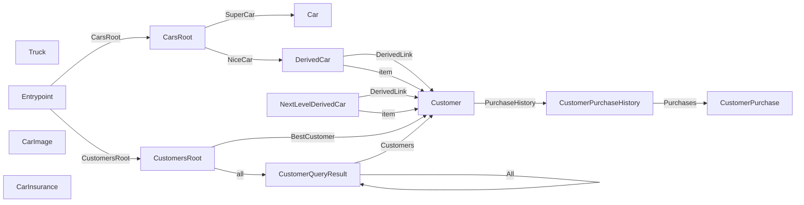

# CarShack API

RESTyard demo API for managing cars and customers

**Version:** 1.2.3

**Entry Point:** [Entrypoint](#entrypoint)

## Table of Contents

- [Entrypoint](#entrypoint)
- [CustomersRoot](#customersroot)
- [CarsRoot](#carsroot)
- [CustomerQueryResult](#customerqueryresult)
- [Customer](#customer)
- [DerivedCar](#derivedcar)
- [Car](#car)
- [CustomerPurchaseHistory](#customerpurchasehistory)
- [CustomerPurchase](#customerpurchase)
- [Truck](#truck)
- [CarImage](#carimage)
- [CarInsurance](#carinsurance)
- [NextLevelDerivedCar](#nextlevelderivedcar)

## API Map

## Entrypoint

#### Title

Entry to the Rest API

#### Classes

- `Entrypoint`

### Properties

| Property | Type | Required | Description |
|---|---|---|---|
| MyType | [type](#definition-type) | no |  |

### Links

| Relation | Target | Description |
|---|---|---|
| CustomersRoot | [CustomersRoot](#customersroot) |  |
| CarsRoot | [CarsRoot](#carsroot) |  |
| self | [Entrypoint](#entrypoint) |  |

## CustomersRoot

#### Title

The Customers API

#### Classes

- `CustomersRoot`

### Links

| Relation | Target | Description |
|---|---|---|
| all | [CustomerQueryResult](#customerqueryresult) |  |
| BestCustomer | [Customer](#customer) |  |
| self | [CustomersRoot](#customersroot) |  |

### Actions

| Action | Description | Links to |
|---|---|---|
| CreateCustomer |  |  |

  | Parameter | Type | Required | Description |
  |---|---|---|---|
  | Name | string | no |  |
| CreateQuery |  |  |

  | Parameter | Type | Required | Description |
  |---|---|---|---|
  | Pagination | object | no |  |
  | SortBy | object | no |  |
  | Filter | object | no |  |

**Referenced by:**

- [Entrypoint](#entrypoint-links) (link: CustomersRoot)

## CarsRoot

#### Title

The Cars API

#### Classes

- `CarsRoot`

### Links

| Relation | Target | Description |
|---|---|---|
| NiceCar | [DerivedCar](#derivedcar) |  |
| SuperCar | [Car](#car) |  |
| self | [CarsRoot](#carsroot) |  |

### Actions

| Action | Description | Links to |
|---|---|---|
| UploadCarImage |  |  |

  | Parameter | Type | Required | Description |
  |---|---|---|---|
  | Text | string | no |  |
  | Flag | boolean | no |  |
| UploadInsuranceScan |  |  |

**Referenced by:**

- [Entrypoint](#entrypoint-links) (link: CarsRoot)

## CustomerQueryResult

#### Title

Query result on Customer

#### Classes

- `CustomersQueryResult`

### Properties

| Property | Type | Required | Description |
|---|---|---|---|
| TotalEntities | integer | no |  |
| CurrentEntitiesCount | integer | no |  |

### Links

| Relation | Target | Description |
|---|---|---|
| Next *(optional)* | [CustomerQueryResult](#customerqueryresult) |  |
| Previous *(optional)* | [CustomerQueryResult](#customerqueryresult) |  |
| Last *(optional)* | [CustomerQueryResult](#customerqueryresult) |  |
| All *(optional)* | [CustomerQueryResult](#customerqueryresult) |  |
| self | [CustomerQueryResult](#customerqueryresult) |  |

### Embedded Entities

| Relation | Target | Collection | Description |
|---|---|---|---|
| Customers | [Customer](#customer) | yes |  |

**Referenced by:**

- [CustomersRoot](#customersroot-links) (link: all)
- [CustomerQueryResult](#customerqueryresult-links) (link: Next)
- [CustomerQueryResult](#customerqueryresult-links) (link: Previous)
- [CustomerQueryResult](#customerqueryresult-links) (link: Last)
- [CustomerQueryResult](#customerqueryresult-links) (link: All)

## Customer

#### Classes

- `Customer`

### Properties

| Property | Type | Required | Description |
|---|---|---|---|
| Age | integer | no |  |
| FullName | string | no |  |
| Address | object | no |  |
| IsFavorite | boolean | no |  |

### Links

| Relation | Target | Description |
|---|---|---|
| PurchaseHistory | [CustomerPurchaseHistory](#customerpurchasehistory) |  |
| self | [Customer](#customer) |  |

### Actions

| Action | Description | Links to |
|---|---|---|
| CustomerMove |  |  |

  | Parameter | Type | Required | Description |
  |---|---|---|---|
  | Address | object | no |  |
| CustomerRemove |  |  |
| MarkAsFavorite |  |  |

  | Parameter | Type | Required | Description |
  |---|---|---|---|
  | Customer | string | no | Format: `uri` |
| BuyCar |  |  |

  | Parameter | Type | Required | Description |
  |---|---|---|---|
  | Brand | string | no |  |
  | CarId | integer | no |  |
  | Price | number | no |  |
  | HiddenProperty | number | no |  |

**Referenced by:**

- [DerivedCar](#derivedcar-links) (link: DerivedLink)
- [DerivedCar](#derivedcar-embedded) (embedded: item)
- [NextLevelDerivedCar](#nextlevelderivedcar-links) (link: DerivedLink)
- [NextLevelDerivedCar](#nextlevelderivedcar-embedded) (embedded: item)
- [CustomersRoot](#customersroot-links) (link: BestCustomer)
- [CustomerQueryResult](#customerqueryresult-embedded) (embedded: Customers)

## DerivedCar

#### Title

Derived Car

#### Classes

- `DerivedCar`

### Properties

| Property | Type | Required | Description |
|---|---|---|---|
| DerivedProperty | string | no |  |
| Id | integer | no |  |
| Brand | string | no |  |
| PriceDevelopment | number[] | no |  |
| PopularCountries | [country](#definition-country)[] | no |  |
| MostPopularIn | [country](#definition-country) | no |  |
| LastInspection | string | no | Format: `date` |

### Links

| Relation | Target | Description |
|---|---|---|
| DerivedLink *(optional)* | [Customer](#customer) |  |
| self | [DerivedCar](#derivedcar) |  |

### Actions

| Action | Description | Links to |
|---|---|---|
| DerivedOperation |  |  |
| UpdateInspection |  |  |

  | Parameter | Type | Required | Description |
  |---|---|---|---|
  | NewInspection | string | no | Format: `date` |

### Embedded Entities

| Relation | Target | Collection | Description |
|---|---|---|---|
| item | [Customer](#customer) | yes |  |

**Referenced by:**

- [CarsRoot](#carsroot-links) (link: NiceCar)

## Car

#### Title

A Car

#### Classes

- `Car`

### Properties

| Property | Type | Required | Description |
|---|---|---|---|
| Id | integer | no |  |
| Brand | string | no |  |
| PriceDevelopment | number[] | no |  |
| PopularCountries | [country](#definition-country)[] | no |  |
| MostPopularIn | [country](#definition-country) | no |  |
| LastInspection | string | no | Format: `date` |

### Links

| Relation | Target | Description |
|---|---|---|
| self | [Car](#car) |  |

### Actions

| Action | Description | Links to |
|---|---|---|
| UpdateInspection |  |  |

  | Parameter | Type | Required | Description |
  |---|---|---|---|
  | NewInspection | string | no | Format: `date` |

**Referenced by:**

- [CarsRoot](#carsroot-links) (link: SuperCar)

## CustomerPurchaseHistory

#### Classes

- `CustomerPurchaseHistory`

### Links

| Relation | Target | Description |
|---|---|---|
| self | [CustomerPurchaseHistory](#customerpurchasehistory) |  |

### Embedded Entities

| Relation | Target | Collection | Description |
|---|---|---|---|
| Purchases | [CustomerPurchase](#customerpurchase) | yes |  |

**Referenced by:**

- [Customer](#customer-links) (link: PurchaseHistory)

## CustomerPurchase

#### Classes

- `CustomerPurchase`

### Properties

| Property | Type | Required | Description |
|---|---|---|---|
| Amount | integer | no |  |
| CardNumber | string | no |  |
| CardType | string | no |  |

**Referenced by:**

- [CustomerPurchaseHistory](#customerpurchasehistory-embedded) (embedded: Purchases)

## Truck

#### Title

A truck

#### Classes

- `Truck`

### Properties

| Property | Type | Required | Description |
|---|---|---|---|
| Brand | string | no |  |
| Id | integer | no |  |

## CarImage

#### Title

Image for a car

#### Classes

- `CarImage`

### Links

| Relation | Target | Description |
|---|---|---|
| self | [CarImage](#carimage) |  |

## CarInsurance

#### Title

Insurance scan for a car

#### Classes

- `CarInsurance`

### Links

| Relation | Target | Description |
|---|---|---|
| self | [CarInsurance](#carinsurance) |  |

## NextLevelDerivedCar

#### Title

Derives from Derived Car

#### Classes

- `NextLevelDerivedCar`

### Properties

| Property | Type | Required | Description |
|---|---|---|---|
| NextLevelDerivedProperty | string | no |  |
| DerivedProperty | string | no |  |
| Id | integer | no |  |
| Brand | string | no |  |
| PriceDevelopment | number[] | no |  |
| PopularCountries | [country](#definition-country)[] | no |  |
| MostPopularIn | [country](#definition-country) | no |  |
| LastInspection | string | no | Format: `date` |

### Links

| Relation | Target | Description |
|---|---|---|
| self | [NextLevelDerivedCar](#nextlevelderivedcar) |  |
| DerivedLink *(optional)* | [Customer](#customer) |  |

### Actions

| Action | Description | Links to |
|---|---|---|
| DerivedOperation |  |  |
| UpdateInspection |  |  |

  | Parameter | Type | Required | Description |
  |---|---|---|---|
  | NewInspection | string | no | Format: `date` |

### Embedded Entities

| Relation | Target | Collection | Description |
|---|---|---|---|
| item | [Customer](#customer) | yes |  |