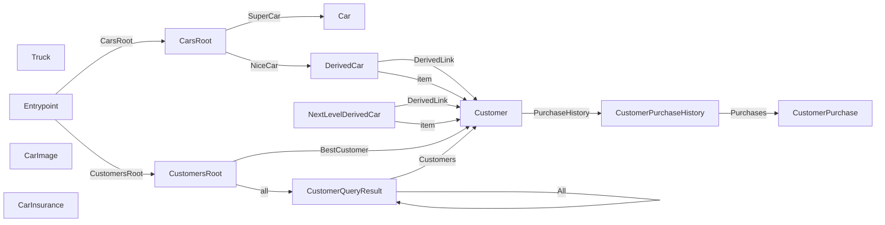

# API Map

```mermaid
graph LR
    Truck["Truck"]
    Entrypoint["Entrypoint"]
    CarsRoot["CarsRoot"]
    Car["Car"]
    CarImage["CarImage"]
    CarInsurance["CarInsurance"]
    DerivedCar["DerivedCar"]
    NextLevelDerivedCar["NextLevelDerivedCar"]
    CustomersRoot["CustomersRoot"]
    CustomerPurchase["CustomerPurchase"]
    CustomerPurchaseHistory["CustomerPurchaseHistory"]
    Customer["Customer"]
    CustomerQueryResult["CustomerQueryResult"]

    Entrypoint -- "CustomersRoot" --> CustomersRoot
    Entrypoint -- "CarsRoot" --> CarsRoot
    CarsRoot -- "NiceCar" --> DerivedCar
    CarsRoot -- "SuperCar" --> Car
    DerivedCar -- "DerivedLink" --> Customer
    DerivedCar -- "item" --> Customer
    NextLevelDerivedCar -- "DerivedLink" --> Customer
    NextLevelDerivedCar -- "item" --> Customer
    CustomersRoot -- "all" --> CustomerQueryResult
    CustomersRoot -- "BestCustomer" --> Customer
    CustomerPurchaseHistory -- "Purchases" --> CustomerPurchase
    Customer -- "PurchaseHistory" --> CustomerPurchaseHistory
    CustomerQueryResult -- "Next" --> CustomerQueryResult
    CustomerQueryResult -- "Previous" --> CustomerQueryResult
    CustomerQueryResult -- "Last" --> CustomerQueryResult
    CustomerQueryResult -- "All" --> CustomerQueryResult
    CustomerQueryResult -- "Customers" --> Customer
```
