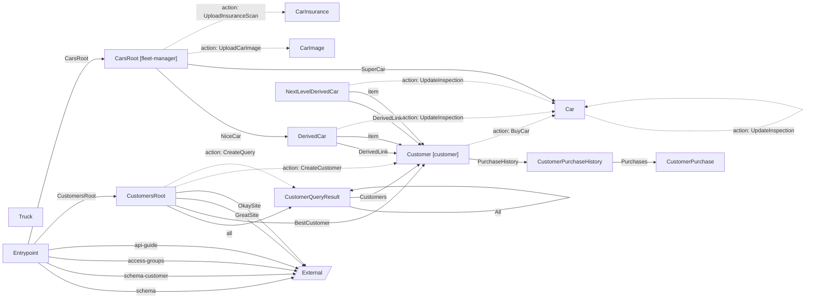

# API Map

```mermaid
graph LR
    Truck["Truck"]
    Entrypoint["Entrypoint"]
    CarsRoot["CarsRoot [fleet-manager]"]
    Car["Car"]
    CarImage["CarImage"]
    CarInsurance["CarInsurance"]
    DerivedCar["DerivedCar"]
    NextLevelDerivedCar["NextLevelDerivedCar"]
    CustomersRoot["CustomersRoot"]
    CustomerPurchase["CustomerPurchase"]
    CustomerPurchaseHistory["CustomerPurchaseHistory"]
    Customer["Customer [customer]"]
    CustomerQueryResult["CustomerQueryResult"]
    _external[/"External"/]

    Entrypoint -- "schema" --> _external
    Entrypoint -- "schema-customer" --> _external
    Entrypoint -- "access-groups" --> _external
    Entrypoint -- "api-guide" --> _external
    Entrypoint -- "CustomersRoot" --> CustomersRoot
    Entrypoint -- "CarsRoot" --> CarsRoot
    CarsRoot -- "NiceCar" --> DerivedCar
    CarsRoot -- "SuperCar" --> Car
    CarsRoot -. "action: UploadCarImage" .-> CarImage
    CarsRoot -. "action: UploadInsuranceScan" .-> CarInsurance
    Car -. "action: UpdateInspection" .-> Car
    DerivedCar -- "DerivedLink" --> Customer
    DerivedCar -- "item" --> Customer
    DerivedCar -. "action: UpdateInspection" .-> Car
    NextLevelDerivedCar -- "DerivedLink" --> Customer
    NextLevelDerivedCar -- "item" --> Customer
    NextLevelDerivedCar -. "action: UpdateInspection" .-> Car
    CustomersRoot -- "all" --> CustomerQueryResult
    CustomersRoot -- "BestCustomer" --> Customer
    CustomersRoot -- "GreatSite" --> _external
    CustomersRoot -- "OkaySite" --> _external
    CustomersRoot -. "action: CreateCustomer" .-> Customer
    CustomersRoot -. "action: CreateQuery" .-> CustomerQueryResult
    CustomerPurchaseHistory -- "Purchases" --> CustomerPurchase
    Customer -- "PurchaseHistory" --> CustomerPurchaseHistory
    Customer -. "action: BuyCar" .-> Car
    CustomerQueryResult -- "Next" --> CustomerQueryResult
    CustomerQueryResult -- "Previous" --> CustomerQueryResult
    CustomerQueryResult -- "Last" --> CustomerQueryResult
    CustomerQueryResult -- "All" --> CustomerQueryResult
    CustomerQueryResult -- "Customers" --> Customer
```
