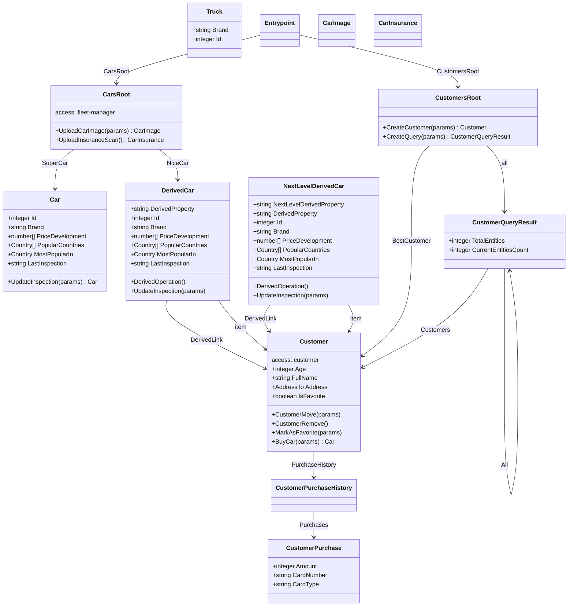

# HTOs

```mermaid
classDiagram
    class Truck {
        +string Brand
        +integer Id
    }
    class Entrypoint {
    }
    class CarsRoot {
        access: fleet-manager
        +UploadCarImage(params) CarImage
        +UploadInsuranceScan() CarInsurance
    }
    class Car {
        +integer Id
        +string Brand
        +number[] PriceDevelopment
        +Country[] PopularCountries
        +Country MostPopularIn
        +string LastInspection
        +UpdateInspection(params) Car
    }
    class CarImage {
    }
    class CarInsurance {
    }
    class DerivedCar {
        +string DerivedProperty
        +integer Id
        +string Brand
        +number[] PriceDevelopment
        +Country[] PopularCountries
        +Country MostPopularIn
        +string LastInspection
        +DerivedOperation()
        +UpdateInspection(params)
    }
    class NextLevelDerivedCar {
        +string NextLevelDerivedProperty
        +string DerivedProperty
        +integer Id
        +string Brand
        +number[] PriceDevelopment
        +Country[] PopularCountries
        +Country MostPopularIn
        +string LastInspection
        +DerivedOperation()
        +UpdateInspection(params)
    }
    class CustomersRoot {
        +CreateCustomer(params) Customer
        +CreateQuery(params) CustomerQueryResult
    }
    class CustomerPurchase {
        +integer Amount
        +string CardNumber
        +string CardType
    }
    class CustomerPurchaseHistory {
    }
    class Customer {
        access: customer
        +integer Age
        +string FullName
        +AddressTo Address
        +boolean IsFavorite
        +CustomerMove(params)
        +CustomerRemove()
        +MarkAsFavorite(params)
        +BuyCar(params) Car
    }
    class CustomerQueryResult {
        +integer TotalEntities
        +integer CurrentEntitiesCount
    }
    Entrypoint --> CustomersRoot : CustomersRoot
    Entrypoint --> CarsRoot : CarsRoot
    CarsRoot --> DerivedCar : NiceCar
    CarsRoot --> Car : SuperCar
    DerivedCar --> Customer : DerivedLink
    DerivedCar --> Customer : item
    NextLevelDerivedCar --> Customer : DerivedLink
    NextLevelDerivedCar --> Customer : item
    CustomersRoot --> CustomerQueryResult : all
    CustomersRoot --> Customer : BestCustomer
    CustomerPurchaseHistory --> CustomerPurchase : Purchases
    Customer --> CustomerPurchaseHistory : PurchaseHistory
    CustomerQueryResult --> CustomerQueryResult : Next
    CustomerQueryResult --> CustomerQueryResult : Previous
    CustomerQueryResult --> CustomerQueryResult : Last
    CustomerQueryResult --> CustomerQueryResult : All
    CustomerQueryResult --> Customer : Customers
```
