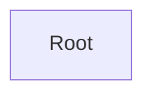

# API Documentation

**Entry Point:** [Root](#root)

## Table of Contents

- [Root](#root)

## API Map

## Root

#### Classes

- `Root`

### Actions

#### BuyCar *(optional)*

Purchase a car.

**Parameters:**

| Parameter | Type | Required | Description |
|---|---|---|---|
| carId | integer | yes | The car identifier |
| color | string | no |  |