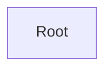

# API Documentation

## Table of Contents

- [Root](#root)

## API Map

## Root

**Classes:** `Root`

### Actions

| Action | Description |
|---|---|
| BuyCar *(optional)* | Purchase a car. |

  | Parameter | Type | Required |
  |---|---|---|
  | carId | integer | yes |
  | color | string | no |