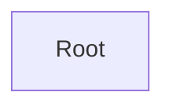

# API Documentation

**Entry Point:** [Root](#root)

## Table of Contents

- [Root](#root)

## API Map

## Root

#### Classes

- `Root`

### Actions

| Action | Description | Links to |
|---|---|---|
| BuyCar *(optional)* | Purchase a car. |  |

  | Parameter | Type | Required | Description |
  |---|---|---|---|
  | carId | integer | yes | The car identifier |
  | color | string | no |  |