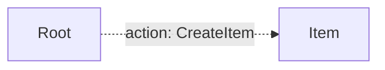

# API Documentation

**Entry Point:** [Root](#root)

## Table of Contents

- [Root](#root)
- [Item](#item)

## API Map

## Root

#### Classes

- `Root`

### Actions

#### CreateItem *(optional)*

Creates a new item.

**Returns:** [Item](#item)

## Item

#### Classes

- `Item`

**Referenced by:**

- [Root → CreateItem](#root-createitem) (action result)