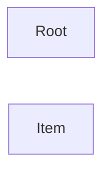

# API Documentation

**Entry Point:** [Root](#root)

## Table of Contents

- [Root](#root)
- [Item](#item)

## API Map

## Root

#### Classes

- `Root`

### Actions

| Action | Description | Links to |
|---|---|---|
| CreateItem *(optional)* | Creates a new item. | [Item](#item) |

## Item

#### Classes

- `Item`

**Referenced by:**

- [Root](#root-actions) (action: CreateItem)