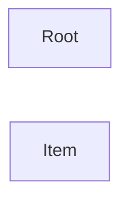

# API Documentation

**Entry Point:** [Root](#root)

## Table of Contents

- [Root](#root)
- [Item](#item)

## API Map

## Root

#### Classes

`Root`

### Actions

| Action | Description |
|---|---|
| CreateItem *(optional)* | Creates a new item. Returns: [Item](#item) |

## Item

#### Classes

`Item`