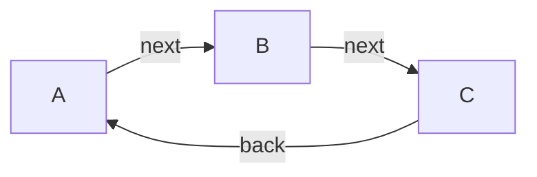

# API Documentation

**Entry Point:** [A](#a)

## Table of Contents

- [A](#a)
- [B](#b)
- [C](#c)

## API Map

## A

#### Classes

- `A`

### Links

| Relation | Target | Access Groups | Description |
|---|---|---|---|
| next *(optional)* | [B](#b) |  |  |

**Referenced by:**

- [C](#c-links) (link: back)

## B

#### Classes

- `B`

### Links

| Relation | Target | Access Groups | Description |
|---|---|---|---|
| next *(optional)* | [C](#c) |  |  |

**Referenced by:**

- [A](#a-links) (link: next)

## C

#### Classes

- `C`

### Links

| Relation | Target | Access Groups | Description |
|---|---|---|---|
| back *(optional)* | [A](#a) |  |  |

**Referenced by:**

- [B](#b-links) (link: next)