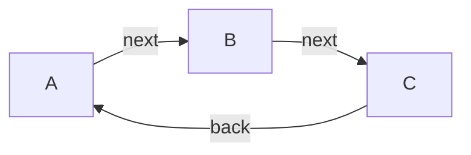

# API Documentation

## Table of Contents

- [A](#a)
- [B](#b)
- [C](#c)

## API Map

## A

**Classes:** `A`

### Links

| Relation | Target | Description |
|---|---|---|
| next *(optional)* | [B](#b) |  |

## B

**Classes:** `B`

### Links

| Relation | Target | Description |
|---|---|---|
| next *(optional)* | [C](#c) |  |

## C

**Classes:** `C`

### Links

| Relation | Target | Description |
|---|---|---|
| back *(optional)* | [A](#a) |  |