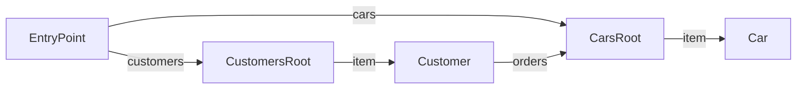

# Car Shop API

A sample API for managing cars and customers.

**Version:** 2.0.0

**Documentation:** https://example.com/docs

**Entry Point:** [EntryPoint](#entrypoint)

## Table of Contents

- [EntryPoint](#entrypoint)
- [CustomersRoot](#customersroot)
- [CarsRoot](#carsroot)
- [Customer](#customer)
- [Car](#car)

## API Map

## EntryPoint

#### Title

API Entry Point

#### Description

The root resource of the Car Shop API. Start here to discover available resources.

#### Classes

`EntryPoint`

### Links

| Relation | Target | Description |
|---|---|---|
| self | [EntryPoint](#entrypoint) |  |
| customers | [CustomersRoot](#customersroot) | Browse and manage customers |
| cars | [CarsRoot](#carsroot) | Browse available cars |

## CustomersRoot

#### Title

Customers Collection

#### Description

Lists all customers with the ability to create new ones.

#### Classes

`CustomersRoot`, `Collection`

### Links

| Relation | Target | Description |
|---|---|---|
| self | [CustomersRoot](#customersroot) |  |

### Actions

| Action | Description |
|---|---|
| CreateCustomer | Registers a new customer in the system. Returns: [Customer](#customer) |

  | Parameter | Type | Required |
  |---|---|---|
  | name | string | yes |
  | email | string | yes |
  | referralCode | string | no |

### Embedded Entities

| Relation | Target | Collection | Description |
|---|---|---|---|
| item | [Customer](#customer) | yes | Customer entries in the collection |

## CarsRoot

#### Title

Cars Collection

#### Description

Browseable list of all available cars.

#### Classes

`CarsRoot`, `Collection`

### Links

| Relation | Target | Description |
|---|---|---|
| self | [CarsRoot](#carsroot) |  |

### Embedded Entities

| Relation | Target | Collection | Description |
|---|---|---|---|
| item | [Car](#car) | yes | Car entries in the collection |

## Customer

#### Title

Customer

#### Description

Represents an individual customer with their profile and available actions.

#### Classes

`Customer`

### Properties

| Property | Type | Required | Description |
|---|---|---|---|
| name | string | yes | Full name of the customer |
| email | string | yes | Primary email address |
| age | integer | no | Age in years |
| isVip | boolean | no | Whether the customer has VIP status |

### Links

| Relation | Target | Description |
|---|---|---|
| self | [Customer](#customer) |  |
| orders *(optional)* | [CarsRoot](#carsroot) | Cars purchased by this customer |

### Actions

| Action | Description |
|---|---|
| MarkAsFavorite *(optional)* | Marks this customer as a favorite for quick access. |
| BuyCar *(optional)* | Initiates a car purchase for this customer. Returns: [Car](#car) |

  | Parameter | Type | Required |
  |---|---|---|
  | carId | integer | yes |
  | financingOption | string | no |

## Car

#### Title

Car

#### Description

Represents an individual car available for purchase.

#### Classes

`Car`

### Properties

| Property | Type | Required | Description |
|---|---|---|---|
| brand | string | yes | Car manufacturer |
| model | string | yes | Model name |
| year | integer | no | Year of manufacture |
| price | number | yes | Price in EUR |
| color | string | no |  |
| features | array | no | List of optional features |

### Links

| Relation | Target | Description |
|---|---|---|
| self | [Car](#car) |  |