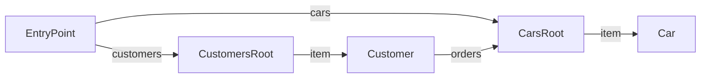

# Car Shop API

A sample API for managing cars and customers.

**Version:** 2.0.0

**Documentation:** https://example.com/docs

**Entry Point:** [EntryPoint](#entrypoint)

## Table of Contents

- [EntryPoint](#entrypoint)
- [CustomersRoot](#customersroot)
- [CarsRoot](#carsroot)
- [Customer](#customer)
- [Car](#car)

**Definitions**

- [Address](#definition-address)

## API Map

## EntryPoint

#### Title

API Entry Point

#### Description

The root resource of the Car Shop API. Start here to discover available resources.

#### Classes

- `EntryPoint`

### Links

| Relation | Target | Description |
|---|---|---|
| self | [EntryPoint](#entrypoint) |  |
| customers | [CustomersRoot](#customersroot) | Browse and manage customers |
| cars | [CarsRoot](#carsroot) | Browse available cars |

## CustomersRoot

#### Title

Customers Collection

#### Description

Lists all customers with the ability to create new ones.

#### Classes

- `CustomersRoot`
- `Collection`

### Links

| Relation | Target | Description |
|---|---|---|
| self | [CustomersRoot](#customersroot) |  |

### Actions

#### CreateCustomer

Create a new customer

Registers a new customer in the system.

**Returns:** [Customer](#customer)

**Parameters:**

| Parameter | Type | Required | Description |
|---|---|---|---|
| name | string | yes | Full name |
| email | string | yes | Email address |
| referralCode | string | no | Optional referral code for discounts |

### Embedded Entities

| Relation | Target | Collection | Description |
|---|---|---|---|
| item | [Customer](#customer) | yes | Customer entries in the collection |

**Referenced by:**

- [EntryPoint](#entrypoint-links) (link: customers)

## CarsRoot

#### Title

Cars Collection

#### Description

Browseable list of all available cars.

#### Classes

- `CarsRoot`
- `Collection`

### Links

| Relation | Target | Description |
|---|---|---|
| self | [CarsRoot](#carsroot) |  |

### Embedded Entities

| Relation | Target | Collection | Description |
|---|---|---|---|
| item | [Car](#car) | yes | Car entries in the collection |

**Referenced by:**

- [EntryPoint](#entrypoint-links) (link: cars)
- [Customer](#customer-links) (link: orders)

## Customer

#### Title

Customer

#### Description

Represents an individual customer with their profile and available actions.

#### Classes

- `Customer`

### Properties

| Property | Type | Required | Description |
|---|---|---|---|
| name | string | yes | Full name of the customer |
| email | string | yes | Primary email address. Format: `email` |
| age | integer | no | Age in years |
| isVip | boolean | no | Whether the customer has VIP status |
| address | [Address](#definition-address) | no | Home address |

### Links

| Relation | Target | Description |
|---|---|---|
| self | [Customer](#customer) |  |
| orders *(optional)* | [CarsRoot](#carsroot) | Cars purchased by this customer |

### Actions

#### MarkAsFavorite *(optional)*

Mark as favorite

Marks this customer as a favorite for quick access.

#### BuyCar *(optional)*

Purchase a car

Initiates a car purchase for this customer.

**Returns:** [Car](#car)

**Parameters:**

| Parameter | Type | Required | Description |
|---|---|---|---|
| carId | integer | yes | The car to purchase |
| financingOption | string | no | Payment plan. Values: `cash`, `lease`, `finance`. Default: `cash` |

**Referenced by:**

- [CustomersRoot](#customersroot-embedded) (embedded: item)
- [CustomersRoot → CreateCustomer](#customersroot-createcustomer) (action result)

## Car

#### Title

Car

#### Description

Represents an individual car available for purchase.

#### Classes

- `Car`

### Properties

| Property | Type | Required | Description |
|---|---|---|---|
| brand | string | yes | Car manufacturer |
| model | string | yes | Model name |
| year | integer | no | Year of manufacture |
| price | number | yes | Price in EUR |
| color | string | no | Default: `white` |
| features | string[] | no | List of optional features |

### Links

| Relation | Target | Description |
|---|---|---|
| self | [Car](#car) |  |

**Referenced by:**

- [Customer → BuyCar](#customer-buycar) (action result)
- [CarsRoot](#carsroot-embedded) (embedded: item)

## Definitions

### Definition: Address

A postal address.

**Referenced by:**

- [Customer](#customer)

| Property | Type | Required | Description |
|---|---|---|---|
| street | string | yes | Street name and number |
| city | string | yes | City name |
| zip | string | no | Postal code |