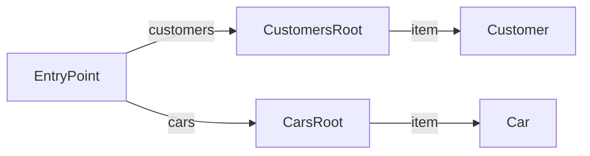

# Car Shop API

**Entry Point:** [EntryPoint](#entrypoint)

## API Map

## EntryPoint

#### Classes

`EntryPoint`

### Links

| Relation | Target | Description |
|---|---|---|
| self *(optional)* | [EntryPoint](#entrypoint) |  |
| customers *(optional)* | [CustomersRoot](#customersroot) |  |
| cars *(optional)* | [CarsRoot](#carsroot) |  |

## CustomersRoot

#### Classes

`CustomersRoot`

### Embedded Entities

| Relation | Target | Collection | Description |
|---|---|---|---|
| item *(optional)* | [Customer](#customer) | yes |  |

## CarsRoot

#### Classes

`CarsRoot`

### Embedded Entities

| Relation | Target | Collection | Description |
|---|---|---|---|
| item *(optional)* | [Car](#car) | yes |  |

## Customer

#### Classes

`Customer`

### Properties

| Property | Type | Required | Description |
|---|---|---|---|
| name | string | no |  |
| age | integer | no |  |

### Links

| Relation | Target | Description |
|---|---|---|
| self *(optional)* | [Customer](#customer) |  |

### Actions

| Action | Description |
|---|---|
| MarkAsFavorite *(optional)* |  |
| BuyCar *(optional)* |  |

  | Parameter | Type | Required |
  |---|---|---|
  | carId | string | no |

## Car

#### Classes

`Car`