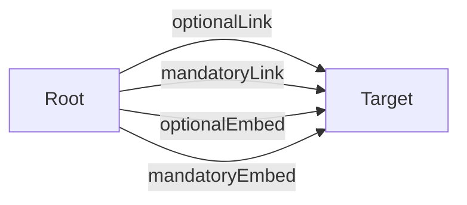

# API Documentation

**Entry Point:** [Root](#root)

## Table of Contents

- [Root](#root)
- [Target](#target)

## API Map

## Root

#### Classes

- `Root`

### Links

| Relation | Target | Access Groups | Description |
|---|---|---|---|
| self | [Root](#root) |  |  |
| optionalLink *(optional)* | [Target](#target) |  |  |
| mandatoryLink | [Target](#target) |  |  |

### Actions

#### OptionalAction *(optional)*

#### MandatoryAction

### Embedded Entities

| Relation | Target | Collection | Access Groups | Description |
|---|---|---|---|---|
| optionalEmbed *(optional)* | [Target](#target) | no |  |  |
| mandatoryEmbed | [Target](#target) | no |  |  |

## Target

#### Classes

- `Target`

**Referenced by:**

- [Root](#root-links) (link: optionalLink)
- [Root](#root-links) (link: mandatoryLink)
- [Root](#root-embedded) (embedded: optionalEmbed)
- [Root](#root-embedded) (embedded: mandatoryEmbed)