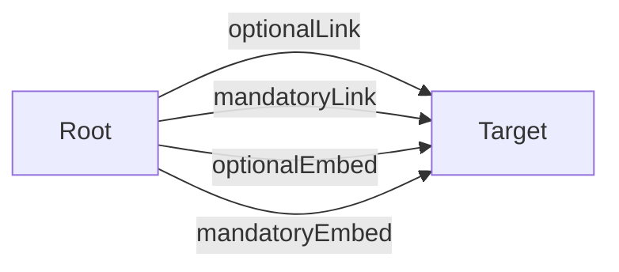

# API Documentation

**Entry Point:** [Root](#root)

## Table of Contents

- [Root](#root)
- [Target](#target)

## API Map

## Root

#### Classes

`Root`

### Links

| Relation | Target | Description |
|---|---|---|
| self | [Root](#root) |  |
| optionalLink *(optional)* | [Target](#target) |  |
| mandatoryLink | [Target](#target) |  |

### Actions

| Action | Description |
|---|---|
| OptionalAction *(optional)* |  |
| MandatoryAction |  |

### Embedded Entities

| Relation | Target | Collection | Description |
|---|---|---|---|
| optionalEmbed *(optional)* | [Target](#target) | no |  |
| mandatoryEmbed | [Target](#target) | no |  |

## Target

#### Classes

`Target`