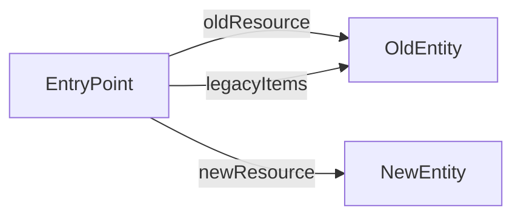

# API Documentation

**Entry Point:** [EntryPoint](#entrypoint)

## Table of Contents

- [EntryPoint](#entrypoint)
- [OldEntity](#oldentity)
- [NewEntity](#newentity)

## API Map

## EntryPoint

#### Classes

- `EntryPoint`

### Links

| Relation | Target | Description |
|---|---|---|
| **[Deprecated]** oldResource *(optional)* | [OldEntity](#oldentity) | Use newResource instead |
| newResource *(optional)* | [NewEntity](#newentity) |  |

### Actions

#### **[Deprecated]** OldAction *(optional)*

Use NewAction instead

### Embedded Entities

| Relation | Target | Collection | Description |
|---|---|---|---|
| **[Deprecated]** legacyItems *(optional)* | [OldEntity](#oldentity) | no | Use newResource link instead |

## **[Deprecated]** OldEntity

> This entity is deprecated. Use NewEntity instead.

#### Classes

- `OldEntity`

**Referenced by:**

- [EntryPoint](#entrypoint-links) (link: oldResource)
- [EntryPoint](#entrypoint-embedded) (embedded: legacyItems)

## NewEntity

#### Classes

- `NewEntity`

**Referenced by:**

- [EntryPoint](#entrypoint-links) (link: newResource)